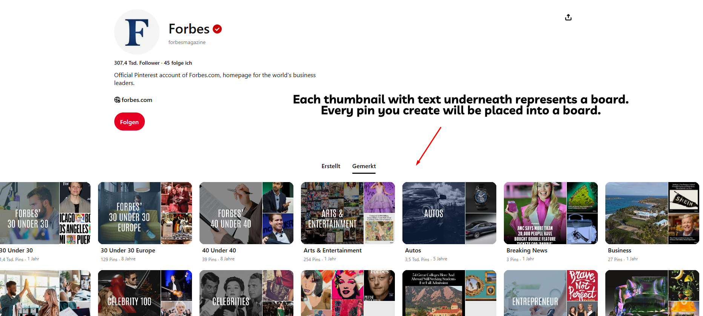
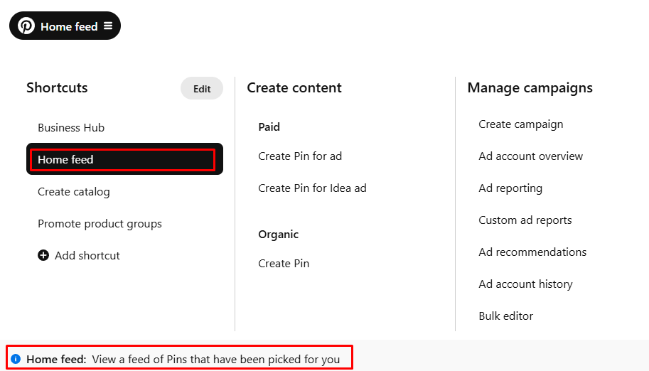
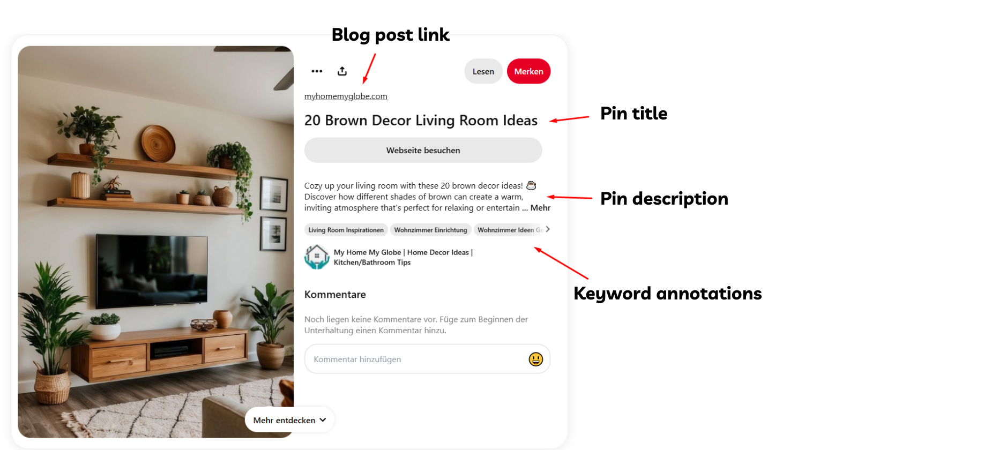

## 第 1 页

在我们深入之前，我想确保你熟悉我们在这个系统和工具中使用的所有关键术语。
即使你已经在 Pinterest 上有一段时间了，这也是一个很好的复习，让一切保持清晰！

**Board**
当创建 Board 时，你按主题或话题组织你的 Pins。Board 通过将相似的想法分组来帮助你管理你的内容。

**Business Account**
将你的个人账户转换为 Business Account 以访问高级功能，如 analytics、advertising 选项和其他帮助你监控和发展 Pinterest 存在的商业工具。

**CTR (Click-Through Rate)**
你跟踪 CTR 以查看点击 Pin 链接的观众百分比。这个指标告诉你你的 Pins 在从 Pinterest 驱动流量到你的网站方面的有效性。

**Content Clusters**
将相关文章或 Pins 分组成 content clusters 以定位相似的关键词和话题。通过这样做，你建立主题权威并维持长期流量增长。

**Duplicate Content**
完全相同或几乎相同的 Pins 或图片——避免发布它们。Pinterest 的算法可以检测到重复内容，这可能会损害你账户的整体表现。

**GA (Google Analytics)**
将 Google Analytics 集成到你的系统中以监控网站流量。GA 为你提供除 Pinterest 原生 analytics 之外的详细洞察，帮助你评估链接内容的性能。

**Hostinger**
我们使用 Hostinger 来高效设置和管理多个网站。它非常适合创建基于模板的网站，但当网站开始获得更多流量时，我们会切换到另一个托管提供商。

## 第 2 页

**Home Feed**
你的 Home Feed 是 Pinterest 上的主页面，根据你的兴趣、搜索历史和互动显示个性化的 Pin 选择。这是你发现新鲜内容和趋势的地方。

**Incognito Tab**
当你需要看到无偏见的搜索结果或趋势数据时，在 incognito tab 中浏览 Pinterest，不受你的个性化历史记录和 cookies 的影响。

**Interests**
你的 interests 是定义你 Pinterest 体验的话题和类别。Pinterest 使用这些来为你推荐 Pins 并专门定制内容。

**Outbound Click**
当你点击 Pin 中带你到外部网站的链接时，这算作一次 outbound click。如果你想要将你的内容货币化或驱动流量到你的网站，这是一个关键指标。

**Pin (Image/Video Post)**
每个 Pin 都是你在 Pinterest 上发布的图片或视频。当你创建 Pin 时，包括一个吸引人的标题、带有相关关键词注释的详细描述，以及到你博客文章的链接。

## 第 3 页

**Save**
你通过将 Pin 添加到你的一个 board 来"save"（保存）它。无论你在 Pinterest 上找到 Pin 还是使用 Pinterest app、browser extension 或你设备的分享功能从网上保存图片，保存都能帮助你策划激发你的内容。

**Related Pins**
当你查看 Pin 的详细页面时，你会看到带有 related Pins 的"More like this"部分。与这些建议互动，探索与你兴趣和策略一致的其他内容。

**Pinterest Analytics**
使用 Pinterest Analytics（可在 analytics.pinterest.com 访问）来跟踪你的 Pins 和 Boards 的表现。此工具为你提供可用于微调内容和策略的数据。

## 第 4 页

**Pinterest Predicts**
依靠 Pinterest Predicts 作为年度预测报告，识别新兴趋势。使用这些洞察以保持领先于即将捕获你受众兴趣的内容。

**Pinterest Trends**
访问 Pinterest Trends 以查看哪些话题和关键词目前正在热门。这个免费工具帮助你确保你的内容保持新鲜，并与用户当前搜索的内容相关。

**PinSage, Pin2Interest, Pixie**
这些内部 Pinterest 算法分析视觉、文本和上下文数据。它们通过分类你的 Pins、推荐相关内容和优化内容在用户 feeds 中的显示方式来帮助你。

**Proxy**
当管理多个 Pinterest 账户时，你可以使用 proxy 为特定账户分配固定 IP 地址。虽然 proxies 提供的灵活性不如 VPN，但它们帮助你更安全地管理你的账户。

**RPM (Revenue per Mille)**
密切关注 RPM，它估算你每 1,000 次页面浏览获得的收入。这个指标是评估你内容和广告放置盈利能力的关键。

**SOP (Standard Operating Procedure)**
按照 SOP 完成特定任务以保持一致性。这些详细的分步说明确保你在流程中保持效率和准确性。

**Scout Pins**
创建没有标题、描述或 URL 的 Scout Pins 来测试新的互动策略。使用它们来提高互动率，同时保持你的搜索排名信号不受影响。

**Search**
将 Pinterest 视为一个强大的图片搜索引擎。当你使用正确的关键词和注释优化你的 Pins 和 Boards 时，你通过 Pinterest search 提高它们的可发现性。

## 第 5 页

**Rich Pins**
实施 Rich Pins 以自动显示你网站的额外详细信息。当你设置这些时，Pinterest 从你网站的开放图谱元标签中提取标题和描述，为你的受众在 Pin 上直接提供更多上下文。

**Keyword Annotations**
确保你在 pin 和 board 描述中包含相关的 annotations。这些 keyword annotations 帮助 Pinterest 理解你的内容，提高其对目标受众的可见性。

**VPN (Virtual Private Network)**
使用 VPN 创建安全的加密连接，隐藏你的 IP 地址。这在管理多个 Pinterest 账户时至关重要，因为它降低了封禁的风险并增强了你的隐私。

**Overview Sheet**
维护一个 overview sheet——一个集中的文档或电子表格——来跟踪关键词、文章 URL、标题以及跨网站或 Pinterest 账户的任务进度。这帮助你保持有组织并掌握你的策略。

**KW (Keyword)**
将特定的搜索词或短语（keywords）纳入你的内容策略。通过使用正确的 KW 优化你的 Pins 和 Boards，你提高你在 Pinterest 搜索引擎中的可见性。

## 图片

