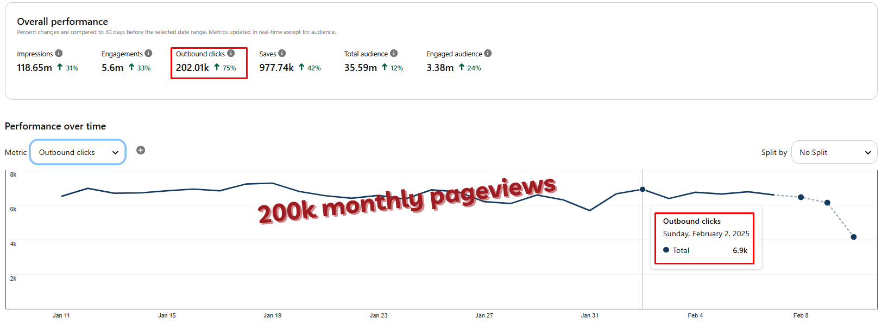

## 第 1 页

Pinclicks* 根据我们的经验，是最好的 Pinterest 关键词研究工具。
我们几乎所有的 KW 和兴趣研究都使用它来：
a) 找到易于排名的 KWs、annotations 和 interests
b) 评估我们成功定位这些 KWs 的机会
它在实现这样的强大结果方面非常有帮助，我强烈建议你试试看。
我们还成功为你争取到了一个专属折扣码：nichegrownerd

如何使用折扣码：
在选择计划并输入你的详细信息时直接应用它即可。
它适用于所有计划。
25% 的折扣对年度计划特别有价值，因为你已经因为年度支付获得了 28% 的折扣。使用折扣码，你总共可以节省超过 46%。
- *（联盟链接，如果你购买，我们将获得佣金，对你没有额外费用。）

## 图片

