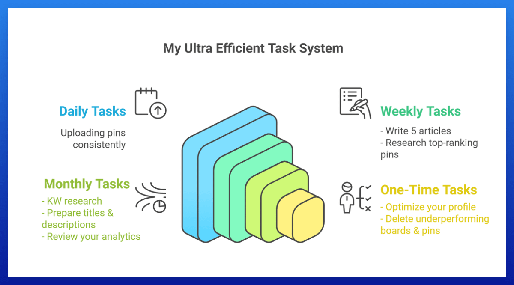

## 第 1 页

我们喜欢让一切都尽可能简单高效，这就是为什么我们将任务构建为四个类别：
每日、每周、每月和一次性待办事项。

### 1. 每日任务：
1. 上传 pins（应该不超过 10 分钟，你可以在这里查看我们的高效流程）。

### 2. 每周任务：
1. 撰写文章——每个网站每周五篇文章。
如果你每天上传 8 到 12 个 pins 到不同的 URL，这就足够了。
对于每篇博客文章，总共创建 20 个 pins 并在 20 天内发布——每天每个博客文章一个 pin。
当然，如果你想写更多也可以。
2. 研究每个 KW 当前正在排名的 pins 类型，并以类似风格创建 pins。

### 3. 每月任务：
1. KW 研究：这是一项重要的任务，你应该专注于它（约 2 小时）。
2. 在你的 overview sheet 中创建吸引人的标题以及 pin 和 board 描述（<5 分钟）。使用我们的 Pin & Board Description Generator 自动执行此步骤，并使用我们的 Catchy Bulk Title Generator 生成标题。
3. 每月深入分析你的账户一次：约 10 分钟。

### 4. 一次性任务：
1. 优化你的 profile：约 10 分钟。

## 第 2 页

2. 删除表现不佳的 boards：约 10 分钟。
意味着：
每周时间投入：约 2 小时。
+
每月时间投入：约 2.5 小时。

## 图片

