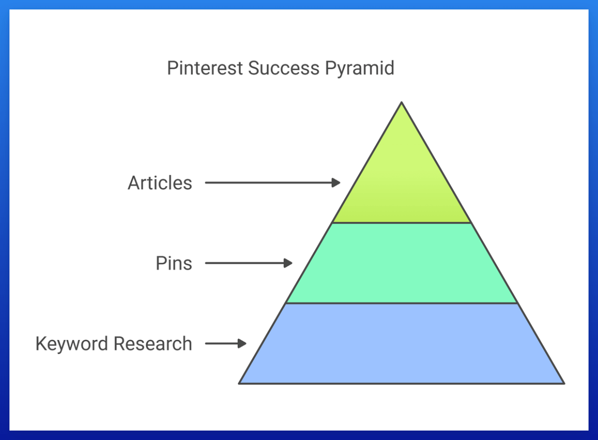
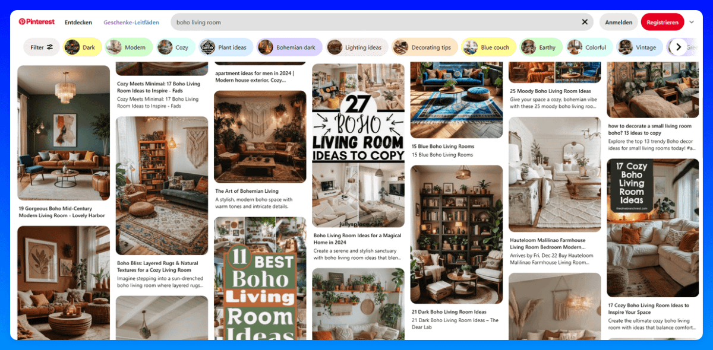

## 第 1 页

在过去的 1.5 年里，我们与大约 100 个合作伙伴网站进行了大规模测试，从中获得了关于识别推动 80% 性能/结果的 20% 任务的一手经验。
我们以最佳方式简化和自动化了这些"核心任务"，这就是为什么我们能够扩展到 300 个网站。

归根结底，你 80% 的精力应该放在这里：

### 1. Keyword Research（关键词研究）——基础
由于 Pinterest 是一个搜索引擎，一切都围绕 KWs、interests 和 tags 构建。
这应该是你的首要关注点——尤其是在开始阶段。
这需要练习才能熟练掌握，所以花时间找到最好的 KWs 并持续测试新的 KWs。
如果 KWs 不能引起你的受众共鸣，即使是最好的 pins 也不会获得 impressions。Pinterest 上的 KWs 与 SEO 中的 KWs 不同，所以我们在这里创建了一个详细的模块来帮助你尽可能高效地学习这一点。

在这些地方加入 KWs 和 annotations——但避免 KW 堆砌：
- Profile 名称和简介

## 第 2 页

- Board 标题和描述
- Pin 标题和描述
- 你文章中的页面内 SEO

### 2. Pins
你的第二个关注点应该是你的 pins。
问自己：
- 你的 pins 是否与你的受众正在搜索的内容一致？
- 它们在视觉上是否有吸引力（记住，Pinterest 是高度视觉化和灵感驱动的）？
- 你使用有效的配色方案吗？
- 哪种 pin 格式最适合你的 KWs 类型？

这里有一个简单的技巧：
在创建 pins 之前，使用 incognito tab 查看已经在排名的内容。
查看：
- 主要的 pin 格式（collage、plain image 或 text overlay）
- 配色方案（这些可能会产生很大的影响）
- product pins 或 ads 是否占主导地位（如果你推广博客文章，这不理想）
- 常见的标题格式

用这些来为你的 pins 获得灵感，并以类似风格创建它们。

### 3. Articles
第三个关注点是文章。

## 第 3 页

它们很重要，但只有当你的 KWs 和 pins 稳固后才会变得重要。
确保你的文章与你上传的 pins 相关，因为 Pinterest 会抓取链接的 URL 来检查它们是否与 pin 的内容匹配（专注于基本的 SEO 实践，如在你的标题、H2、meta description 中添加你的主 KW，以及文章中的次要关键词）。
标题（pin 标题和文章标题）至关重要——它决定了用户是否会点击你的文章（CTR）。吸引人的标题是必不可少的。
最后，确保你的文章在视觉上引人入胜。Pinterest 用户来自"灵感"状态，你的博客应该延续这种感觉，让他们在你的页面上停留更长时间。
我强烈推荐 listicle 文章（列表式文章）——它们在 Pinterest 上的表现始终最好。
例如：
"20 Boho Living Room Ideas You Want to Recreate in 2025"

## 图片

