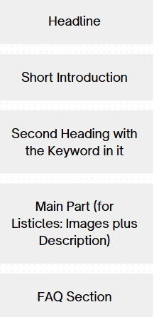
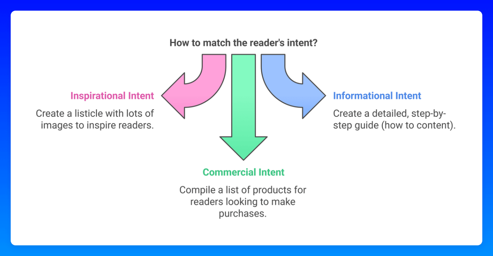

# 44 我们高效的文章结构

> **源文件**: 44-Our_Efficient_Article_Structure.pdf

---

## 文档内容

---

### Page 1/2

我们高效的文章结构

**任何文章的核心要素：**
一个吸引人的标题（你可以使用我们的吸引人标题生成器来创建）
一个简短、个性化且有趣的介绍
你的主要 KW（关键词）出现在标题（H1）和第一个 H2 标题中
在 meta description 中添加你的关键词
FAQ 部分用于覆盖次要关键词

---

### Page 2/2

**匹配读者的（搜索）意图：**
如果他们想要获得灵感并查看图片（例如服装、房间装饰等）-> 创建包含大量图片的 listicle（清单文章）
示例："20 个你不能错过的波西米亚风格客厅装饰创意 2025"
如果他们想要操作指南（例如食谱）-> 提供分步说明
如果他们想要购买产品 -> 创建产品清单文章

**快速获胜提示：**

**使用此提示生成 FAQ、meta description 和介绍：**
"请为以下关键词创建 FAQ、meta description 和介绍：[你的

#### 关键词]

1. 请为关于此关键词的 blog 文章写一个个性化、非正式、简短的介绍。不超过 3-5 句话。请富有创意和友好。
2. 请写一个引人入胜的 meta description（约 150 个字符），包含此关键词。
3. 创建 3 个适合 FAQ 的问题，与关键词匹配并用 2-3 句话回答，向 Google 展示我了解这个细分领域，并覆盖其他次要关键词[如果你想添加次要关键词或问题，可以在这里添加]。"
保持文章最新，并在你的网站上正确组织它们——这通常是被广告提供商批准的关键要求。

---
---
*文档转换时间: 2026-02-02 07:05:16*
*页数: 2 | 图片: 2*
