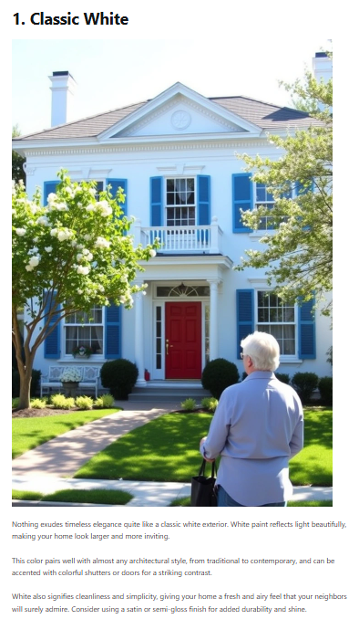
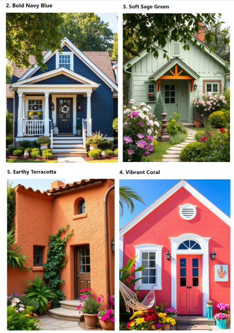

# 45 高效创建清单文章

> **源文件**: 45-Create_Listicles_Efficiently.pdf

---

## 文档内容

---

### Page 1/4

清单文章基础
文章创建章节中的基本原则也适用于清单文章 (listicles)。
在介绍之后，在内容和 FAQ 部分之间插入图片。

**每张图片应该有：**
它自己的标题
简短的描述

---

### Page 2/4

注意事项
我们建议你的清单文章始终覆盖主题的整个范围。
1. 示例 1："运动风格夏季穿搭"

**确保包含以下穿搭创意：**
1. 👗 工作

---

### Page 3/4

2. 🎉 休闲
3. 🧍‍♀️ 不同体型
2. 示例 2："漂亮的房屋颜色"
不要只展示白色的房子——添加各种颜色以吸引更广泛的受众，像这样：
在哪里找图片？

**1. Pinterest：**
你几乎可以为任何主题找到高质量的图片并嵌入它们。
⚠️ 如果你使用其他创作者的图片，务必征得许可并给予适当的署名！

**2. AI 生成图片：**
我们的最爱！你可以自己创建独特的图片。我们为此专门写了一章关于我们的流程和自动化。

---

### Page 4/4

两个有助于创建清单文章的工具
ContentGoblin 和 GetPinMaker（我们在这里展示了使用它们的流程）。
这些工具可以加快内容创建速度，特别是在开始时。

**⚠️ 但是，不要只是复制粘贴输出，因为：**
句子结构经常重复。
词汇选择往往有限，听起来不够个性化。
AI 内容仍然需要手动编辑和校对。
如果你想要高质量、独特的内容，我们建议在发布之前审查输出。
尽管如此，这些工具可以提供很大帮助，我们在自己的工作流程中也使用其中一些。

---
---
*文档转换时间: 2026-02-02 07:05:16*
*页数: 4 | 图片: 2*
