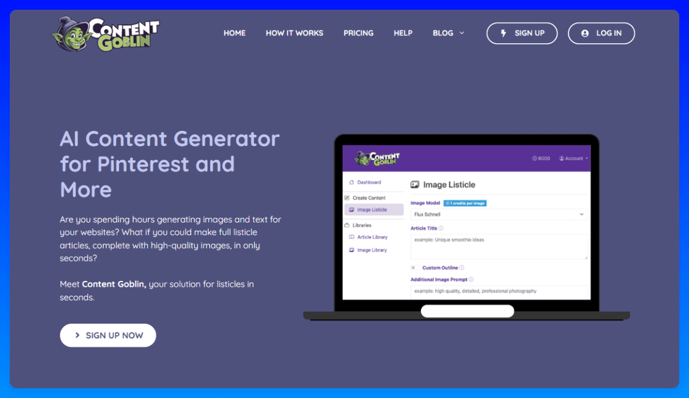
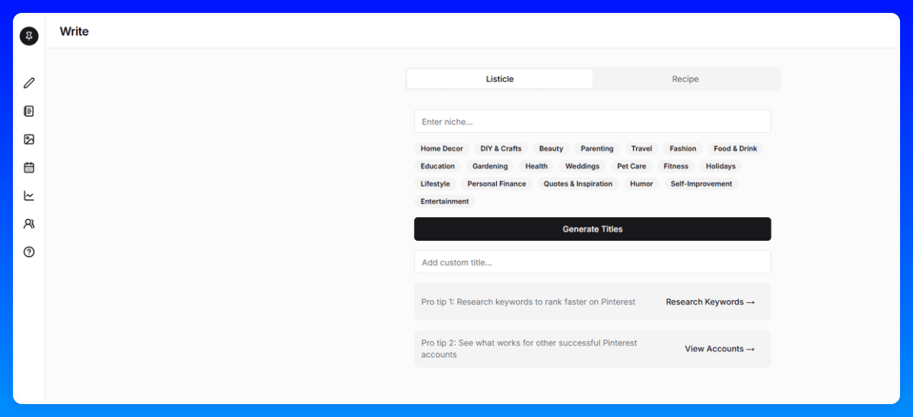
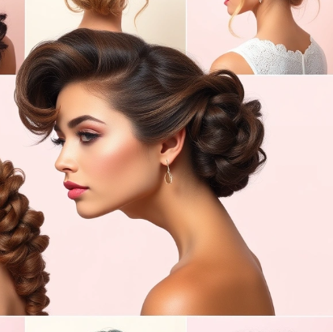
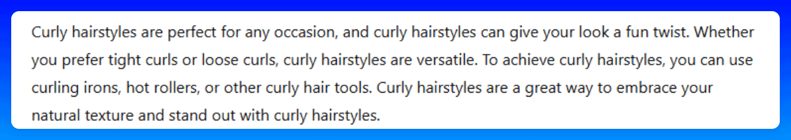

# 46 清单文章工具与人工编辑

> **源文件**: 46-Listicle-Tools_and_Human_Editing.pdf

---

## 文档内容

---

### Page 1/3

对于大多数文章，我们使用这两个工具中的一个，它们已经变得非常好，可以为大多数主题和细分领域生成可靠的成果。
但是，我们仍然建议审查和校对每篇文章，因为它们应该听起来更加个性化。

**ContentGoblin*：**
可以帮助你高效创建清单文章。
ContentGoblin 在某些细分领域（例如食谱、室内和室外）效果很好，但根据我们的经验，在其他领域（例如时尚、化妆等）效果较差。
我们发现 ContentGoblin 对食谱特别有用（你可以在食谱文章部分找到更多信息）。

**GetPinMaker：**
我们主要将 GetPinMaker 用于室内和室外细分领域的文章。

---

### Page 2/3

但是，你可以将它用于任何细分领域。
输出质量很大程度上取决于提示词，因此值得尝试不同的提示词以获得最佳结果。

**人工编辑：**
输出是文章的良好基础——但我们不会就这样发布！
我们总是添加 FAQ 部分、meta description，并创建我们自己的吸引人标题。
之后，我们仔细修改文本，特别注意以下几点：
图片是否不适当或不正确？如果是，我会创建一张新图片

**不适当图片的示例 😂：**
句子开头是否重复或过于相似？如果是，我会重写它们以增加变化。
文本中是否有重复的词？如果是，我会调整和替换它们以提高可读性。

**你的图片描述不应该看起来像这样：**
两个 AI 工具的快速比较（截至 2025 年 2 月）

**GetPinMaker：**

**优点：**
生成特色图片
支持联盟文章（允许预设 Amazon 联盟标签）
建议改进的标题

**缺点：**
如果标题包含"22 个最佳..."，有时只生成 15 张图片

**ContentGoblin*：**

**优点：**
提供更好的 alt 文本
图片质量可调（更高质量成本更高，但每张图片 10 credits 时，质量已经显著提高）
允许选择要生成的确切图片数量

---

### Page 3/3

**缺点：**
文本有时会重复（尽管一些输出真的很好）
*（联盟链接，如果你进行购买，我们会获得佣金，不会给你带来额外成本。）

---
*文档转换时间: 2026-02-02 07:05:16*
*页数: 3 | 图片: 4*
