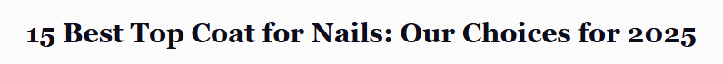
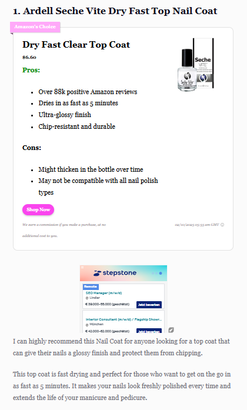
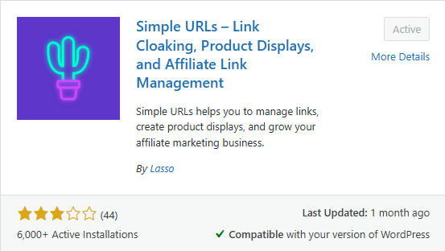
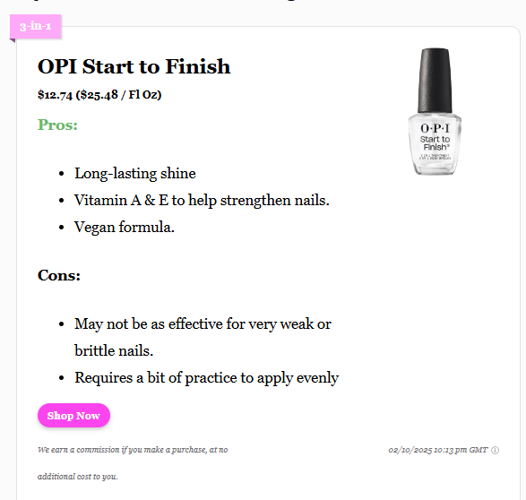

# 47 产品清单文章

> **源文件**: 47-Product_Listicles.pdf

---

## 文档内容

---

### Page 1/4

产品清单文章的结构与普通清单文章略有不同。
但目标保持不变：吸引尽可能多的用户。
然而，在这种情况下，重点在于提供有关特定产品或产品类别的有价值信息，以帮助用户做出购买决策。
这些文章的大多数访问者已经有购买意图；他们只需要有关某些产品的更多细节。
如何构建它
保持描述简短，专注于关键产品细节和优势。
提供更多优点而非缺点，以突出产品价值。
确保内容有帮助且易于浏览。
标题最佳实践

**始终选择一个吸引人的标题，如：**
"XX 款适合初学者的最佳跑鞋"
"XX 本新手妈妈必读书籍"
你也可以使用我们的吸引人标题生成器自动完成此步骤。
产品框示例
这是一个产品框示例，下面有简短文本用于额外说明：

---

### Page 2/4

Amazon 商业账户
我们主要使用 Amazon Associates 进行联盟文章。
1. 创建 Amazon 商业账户和跟踪 ID

**你可以在这里注册 Amazon 商业账户：**
🔗 Amazon Affiliate Program

---

### Page 3/4

2. 将跟踪 ID 添加到你的联盟插件
一旦你的跟踪 ID 设置完成，将其输入到你的联盟插件（例如 Lasso）中以自动生成联盟链接。
Lasso 插件
不要忘记表明这些是联盟链接。（例如：如果你进行购买，我们会获得佣金，不会给你带来额外成本）。
联盟框

**另一个联盟框示例：**

---

### Page 4/4

让你的评论更真实并提高转化率
如果你亲自使用过该产品，请提及它！
你喜欢它的哪些地方？
什么促使你购买它？
有什么让你困扰的地方吗？
你的评论越真实，对读者就越有帮助。
➡️ 有帮助的评论建立信任，增加回访者，并提高你的联盟佣金。
💡 专业提示：GetPinMaker 也有创建产品清单文章的功能！

---
*文档转换时间: 2026-02-02 07:05:16*
*页数: 4 | 图片: 4*
