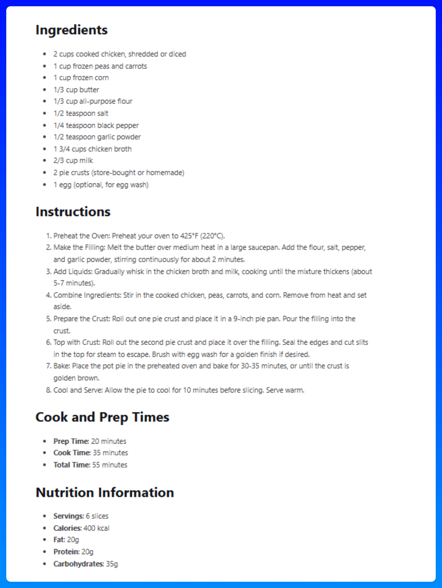
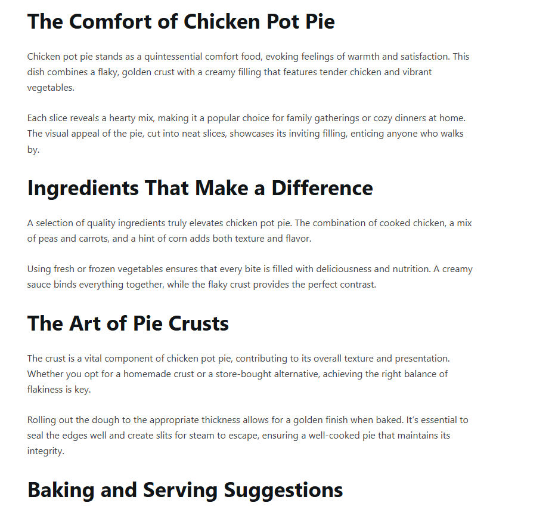
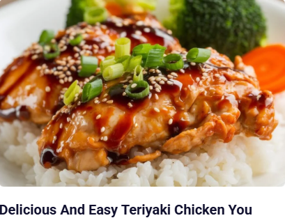
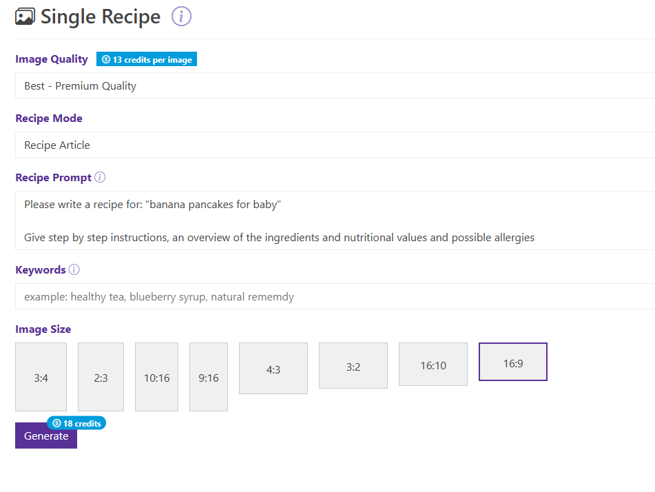

# 48 食谱文章

> **源文件**: 48-Recipe_Articles.pdf

---

## 文档内容

---

### Page 1/4

食谱文章在 Pinterest 上效果很好，但它们的结构与典型的清单文章略有不同。

**核心基本原则仍然适用：**
一个吸引人的标题
用于次要关键词的 FAQ 部分
优化的 meta-description

**但请记住这一点：**
搜索食谱的人不想滚动浏览 25 张图片。他们需要清晰的结构，包括：
一目了然的食材
分步说明
营养值（如相关）
过敏信息
你的目标是以结构良好的格式提供所有基本细节，以便他们可以立即开始烹饪。

---

### Page 2/4

1：提供概述
通过提供清晰的概述，读者可以立即知道这道菜是否适合他们。

**他们可以快速看到：**
需要什么食材
需要多长时间
2. 提供更深入的见解
在此概述之后，你可以分解每个步骤，提供有用的提示，或分享你对食谱的个人经验。
保持段落清晰和结构化，因为这使读者在准备菜肴时易于遵循说明。

---

### Page 3/4

3. 选择一个吸引人的特色图片
4. 专业提示：ContentGoblin 和 GetPinMaker 都有针对食谱的专用选择
这是我在 ContentGoblin* 上使用的食谱提示词，我们通常会稍作调整——你可以试试看。

---

### Page 4/4

选择 16:9 格式，以便图片也可以用作特色图片。
一如既往，初稿后的人工编辑是确保高质量内容的关键（而不仅仅是复制粘贴 AI 输出）。
*（联盟链接，如果你进行购买，我们会获得佣金，不会给你带来额外成本。）

---
*文档转换时间: 2026-02-02 07:05:16*
*页数: 4 | 图片: 4*
