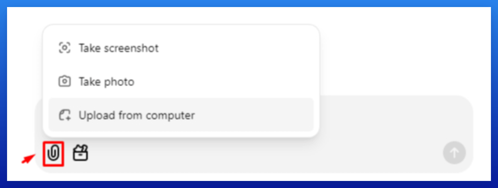

# 51-在创建图片之前务必执行此操作！

## Page 1

为了提升你的 AI 图片质量，并与排名靠前的 Pin 风格保持一致（从而让你的 Pin 有更好的表现机会），我建议执行以下操作：

💡 这对于涉及人物的 AI 生成图片效果尤佳（例如：美甲、妆容、发型、穿搭、婚礼等）。

### 获取更高质量的 AI 图片：

1. 在隐身标签页中下载 3 张表现最佳的 Pin 图片。
2. 将它们上传到 ChatGPT。
3. 让 ChatGPT 基于这些图片创建提示词。

### ChatGPT 提示词：

请创建 10 个 Midjourney 提示词，使其生成的图片与所附示例的风格完全一致。关键词是：[插入你的关键词]
避免在提示词中使用编号、引号以及 '--v 5 --ar 4:5'。你可以使用我们的提示词生成器轻松实现自动化。

---
