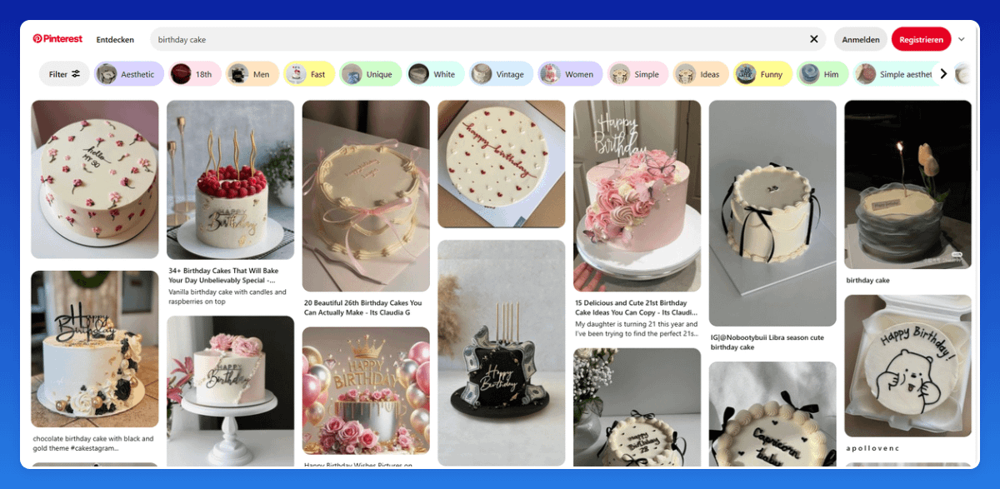
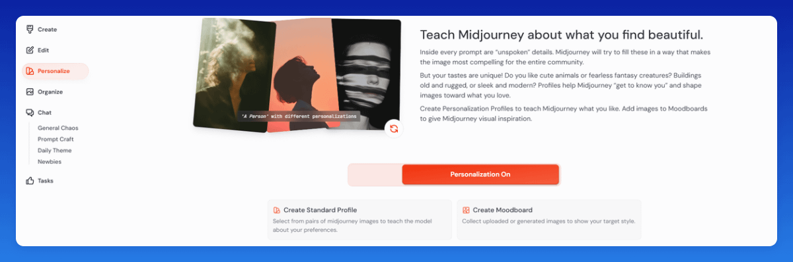
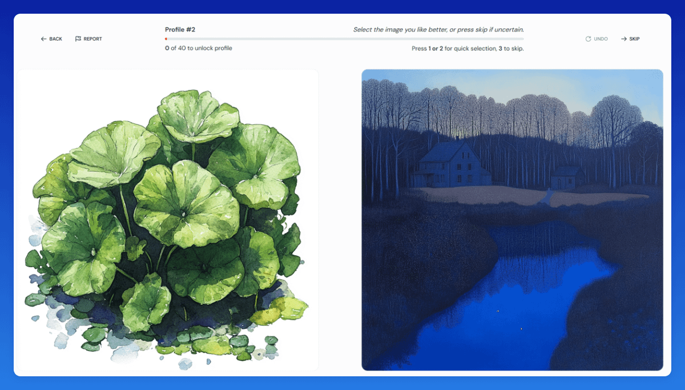
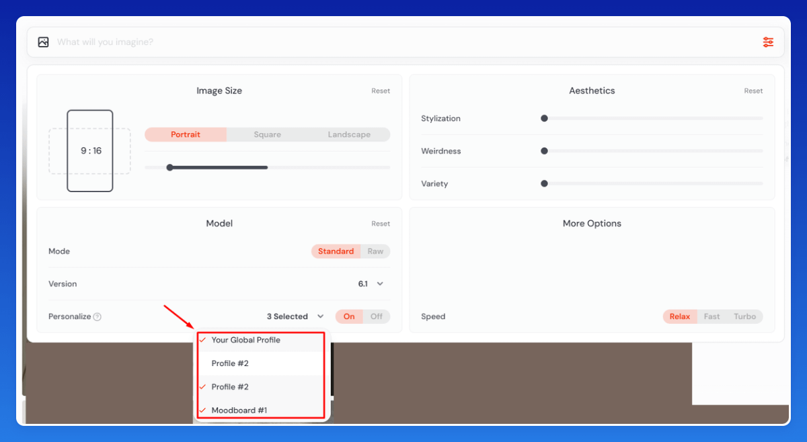

# 52-如何创建更高质量的 AI 图片

## Page 1

Ideogram/Midjourney 在处理逼真的人物、手部、头发或美容相关图片时常常表现不佳。总体而言，Ideogram 的质量优于 Midjourney，但价格也更高。因此，如果你需要大规模制作，需要权衡什么对你更重要——更高的质量还是成本效益。由于我们需要大量的图片，我们主要使用 Midjourney，因为它更高效，但我们会使用一些技巧来提升输出质量。

### 我们如何保持高质量的图片：

1. 在 Pinterest 的隐身标签页中搜索关键词并下载 3-4 张表现最佳的图片。
2. 将这些图片上传到 ChatGPT，并要求其根据它们的风格生成 10 个 Midjourney 提示词。

### 我使用的提示词：

"请创建 10 个 Midjourney 提示词，使其风格与所附图片完全一致。关键词是：'[插入你的关键词]' 请排除编号、引号和 '--v 5 --ar 4:5'。谢谢！"
你可以使用我们的 AI 图片提示词生成器自动化这一步骤。（只需将 3 个排名靠前的 Pin 上传到工具中，它就会为你生成 10 个优化的提示词。）

### AI 图片常见的共同问题包括：

看起来过于未来感
背景过于强烈、杂乱或过于城市化
手部显得不自然（手指过多或过少）
极端的滤镜/对比度，与 Pinterest 表最佳的 Pin 不匹配

---

## Page 2

### 目标：

创建与此关键词排名靠前的 Pin 风格相匹配的 AI 图片，因为我们要知道它们表现良好。

### 进一步提升质量的额外方法：

### 在你的提示词中使用关键词，例如：

"minimalistic background"（极简主义背景）
"natural light"（自然光）
"realistic"（逼真）
"selfie format"（自拍格式）（适用于带有人脸的图片）

### 示例：

如果你注意到 Pinterest 顶级结果中的发型图片通常带有沙龙背景，你可以在 Midjourney/Ideogram 提示词中添加 "hair salon background"。
因此，将你在排名靠前的 Pin 中注意到的每个模式都添加到你的提示词中——这将显著提高你生成的图片质量。
你可以使用我们的 AI 提示词生成器轻松实现这一步骤的自动化。
Midjourney 个性化与情绪板选项
在 Midjourney 中，你还可以更进一步，上传你自己的图片来创建情绪板，帮助 AI 学习你偏好的风格。
我喜欢上传在不同关键词的顶级搜索结果中找到的表现最佳的 Pin。

### 为什么我喜爱"个性化"功能

Midjourney 提供 40 个图片配对，让你选择偏好的风格。

---

## Page 3

### 以下是我有效使用它的方法：

1. 我为不同的细分领域/关键词组创建多个配置文件，这样我就不需要管理多个 MJ 账户。相反，我可以根据正在处理的细分领域/关键词组直接选择相应的配置文件。
2. 如果一对图片中的两张都不符合我的理想风格，我总是跳过它们——有时会多次跳过——直到找到合适的。这个过程需要时间，但是值得的。

---

## Page 4

3. 我对我网站上不同的细分领域/关键词组重复这个过程。虽然需要更多时间，但生成的图片质量会显著提升，因此非常值得付出努力。

### 附加说明：

### 敏感词：

几乎所有的 AI 图片生成工具都会过滤可能导致冒犯性内容图片的某些词汇。它们的 AI 审核会迅速阻止某些词汇，即使它们并非直接冒犯性。为避免这种情况，请用同义词替换。

### 例如：

❌ Shower（淋浴）→ ✅ 使用 rainfall（降雨）
❌ Shot（拍摄）→ ✅ 使用 taken（拍摄）
❌ Nude（裸露）→ ✅ 使用 neutral/minimalistic（中性/极简）

---
