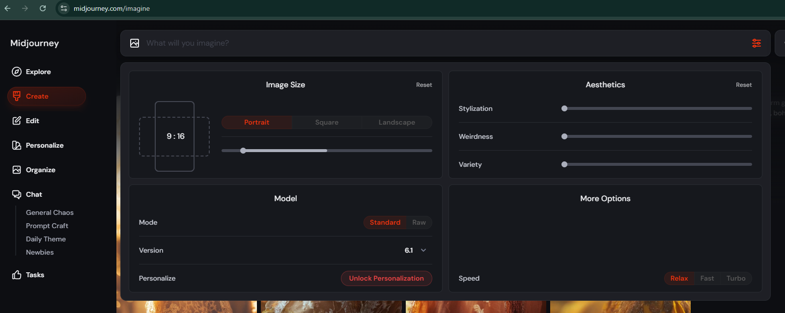
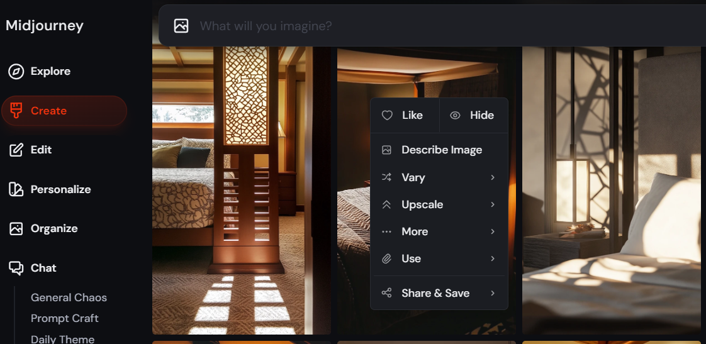
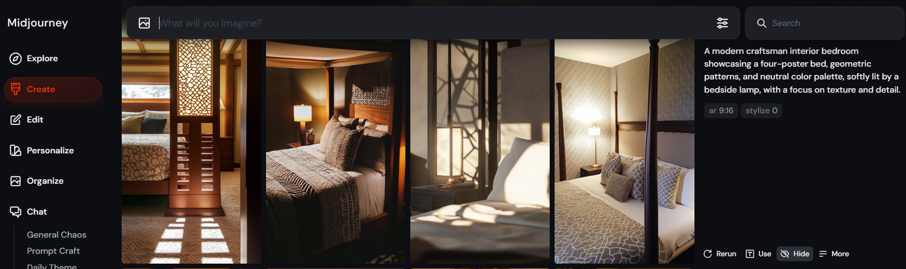
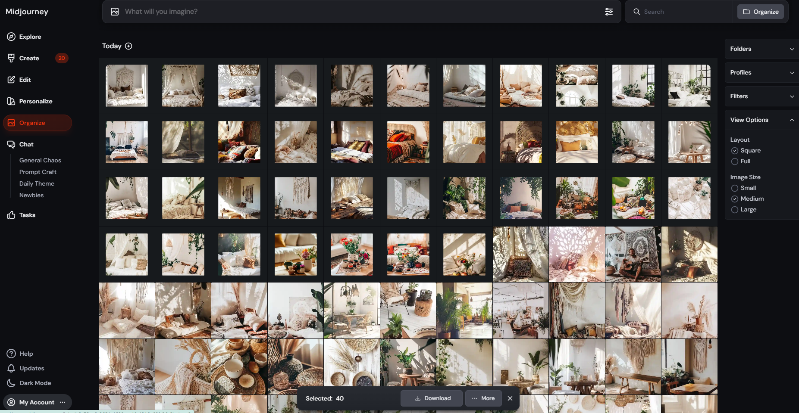

# 54-Midjourney

## Page 1

我们主要将 Midjourney 用于纯图片 Pin。

### 优点：

更实惠（每月 10 美元可获得 200 张图片，每月 30 美元可在放松模式下获得无限图片）
易于下载

### 缺点：

与 Ideogram 相比有时质量较低
创建文字叠加的能力有限或无法创建

### Midjourney 设置

你的项目的最佳设置取决于各种因素。然而，以下设置已在创建更逼真的图片方面效果良好：

图片尺寸：9:16

### 模型：

模式：标准
版本：通常为最新版本（图中为 v6.1）
个性化：关闭
美学风格化：0
怪异程度：0
多样性：0

你可以在此处找到更多信息：https://docs.midjourney.com/docs/

### 典型的初学者 Midjourney 工作流程

1. 可视化你想要创建的图片。

---

## Page 2

2. 打开 midjouney.com 并登录
3. 点击"创建"并在输入字段中输入你的图片提示词。
4. Midjourney 根据你的提示词生成四张不同的图片。
5. 在 Midjourney 中优化或编辑图片（可选）。
   1. 你可以通过右键单击单个图片并选择"隐藏"来隐藏它们。
   2. 如果一组 4 张图片不符合你的需求，点击"隐藏"将它们移除。
6. 下载图片并将它们上传到 Google Drive。
   最佳的工作流程是使用 Google Drive 桌面版（你可以在此处查看我们的整个 Drive 流程。）

   要进一步提高输出，这里有一个更高级的方法：
   1. 使用我们的 AI 提示词生成器创建 10 个优化的提示词。
      只需将 3 个排名靠前的 Pin 上传到工具中，它就会生成 10 个优化的提示词。
   2. 打开现有的或新的 Google 电子表格

---

## Page 3

3. 将从 AI 图片提示词生成器工具复制的提示词粘贴到 Google 电子表格中。
   重命名该工作表以获得更好的结构。
4. 为尽可能多的关键词生成提示词——这使得后续步骤更加高效！
5. 使用我们的图片提示词自动化生成图片

   ⚠️ 重要提示：我强烈建议在第二台 PC 上或在你不需要使用 PC 的时候运行自动化（例如，在睡觉前）。
   当自动化运行时，你的 PC 将被占用，你将无法使用它进行其他任务。

---

## Page 4

在第二个浏览器窗口中打开 midjourney.com 并进入创建（提示：你可以用 ideogram.ai 做类似的事情，尤其是对于文字叠加 Pin）。
使用复制我们的图片提示词自动化来高效地复制和处理提示词。
图片提示词自动化.exe（983 KB）
下载图片提示词自动化，启动它，并根据你的需求进行配置：
关键词数量 = 工作表中标签页的数量
每个关键词的提示词数 = 每个关键词有多少提示词（我们通常使用 10 个）
每个提示词的生成数 = 每个提示词应生成多少图片
确保带有 Midjourney 的浏览器窗口和带有 Google 电子表格的浏览器窗口

---

## Page 5

然后，切换回图片提示词自动化工具并点击开始。
🚨 重要提示：当工具运行时，不要触摸键盘或鼠标！
该工具将最小化，并通过模拟键盘和鼠标操作自动将每个提示词从 Google 电子表格复制到 Midjourney。
一旦图片提示词自动化完成，你将收到一条简短的消息。
从此时起，你可以再次使用鼠标和键盘。

6. 在 Midjourney 中优化或编辑图片（可选）。
   1. 你可以通过右键单击单个图片并选择"隐藏"来隐藏它们。

---

## Page 6

2. 如果一组 4 张图片不符合你的需求，点击"隐藏"将它们移除。

7. 从 Midjourney 下载图片
   专业提示：按每个关键词分组下载图片，这使后续处理更容易，因为无需对它们进行排序（见步骤 4）。
   转到"整理"并滚动到最近生成的图片。

### 选择图片：

按住鼠标左键或在单击每个要下载的图片时按 SHIFT。
要取消选择图片，请按住 SHIFT 并再次单击它。

---

## Page 7

选择完所有图片后，点击"下载"。
图片将被打包成 ZIP 文件（每个文件 50 张图片）。

8. 继续处理下一个关键词并重复这些步骤。

---
