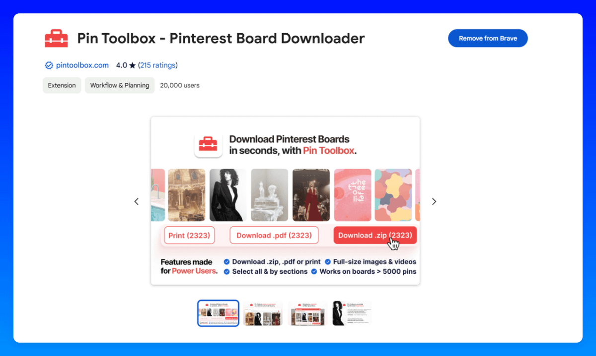

# 60-Pinterest 自有的图片

## Page 1

我知道许多账户，甚至较大的账户，都这样做。
💡 然而，我不建议这样做，因为 Pinterest 明显青睐以前未上传过的新鲜内容。这些 Pin 通常表现好得多！

### ⚠️ 如果你决定仍然这样做，请记住：

确保使用不同格式的图片并将它们转换为 9:16。
像 XnConvert 这样的工具使这变得容易。
我只将此作为最后手段使用，因为很难给予适当的署名。
通常，图片不属于上传它们的账户！因此，这里的版权问题风险最高。
此外，新鲜的原创内容在 Pinterest 上总是效果最好。

### 流程：

打开 Pinterest。
在搜索栏中输入你的关键词以查找相关的图片。
下载视觉上吸引人的图片——理想情况下，那些尚未采用 9:16 格式的图片。
如果可能，记录创作者的姓名，以便你可以给予署名。
检查图片质量——一些图片已被多次重新上传，导致较低分辨率。避免那些。
将它们转换为 9:16 格式。
可选：通过添加文字叠加或将它们转变为拼贴画 Pin 来进一步优化它们。

### 超高效方式：

有一个名为 Pin Toolbox 的 Chrome 扩展程序，允许你一次下载整个看板。
因此，你也可以与创作者建立关系，然后一次下载多张图片——为你节省大量时间！

---
