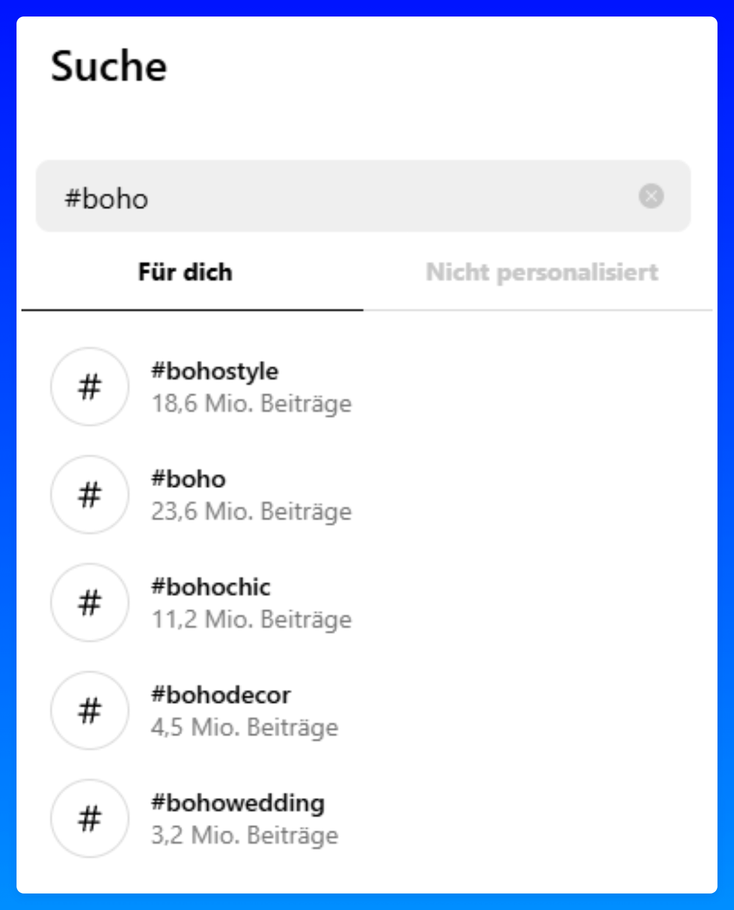
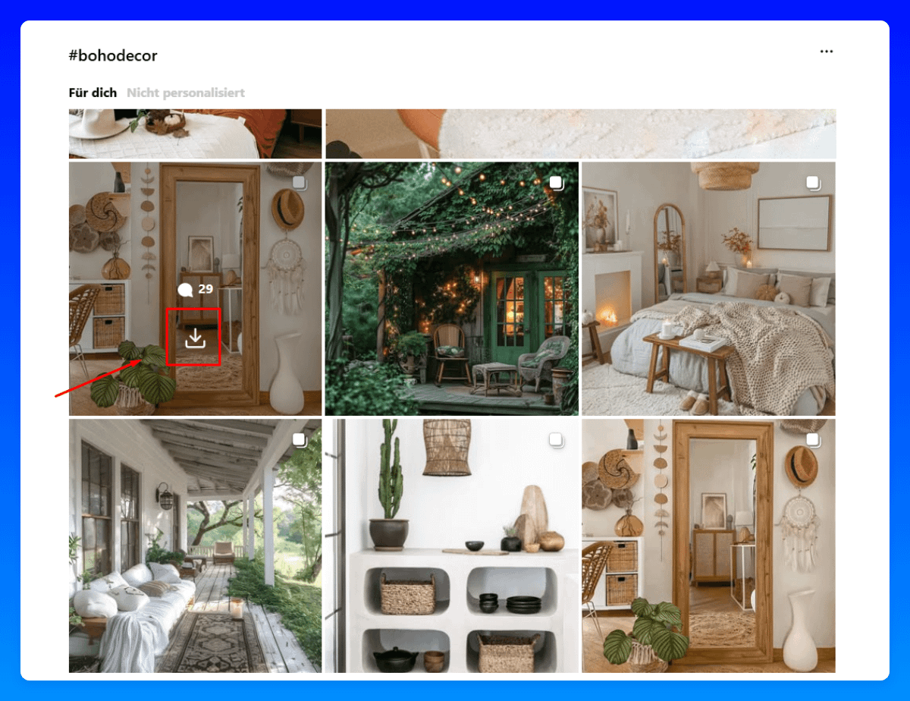

# 61-Instagram 图片

## Page 1

我长期以来一直使用这种策略——远在 AI 图片存在或 AI 成为一个事物之前。
💡 如今，我建议在尝试这条路线之前先尝试 AI 图片，因为它不是最有效的方法，而 AI 图片提供更多的优势。
此外，通过我在这里分享的技巧，你可以显著提高你的 AI 图片质量。
如今，它们有时如此先进，以至于你常常无法分辨差异。

### 版权：

⚠️ 警告：使用此策略的风险自负。
由于你在未经拥有的情况下使用其他创作者的图片，因此存在版权问题风险。
我个人从未遇到过重大问题，但重要的是要意识到这种风险。

### 流程：

在应用或浏览器中打开 Instagram
为了简化此过程，创建一个新账户，你只关注与你的细分领域相关的创作者和账户。
这将训练你的主页源显示更合适的图片。
你也可以使用话题标签查找相关的图片。

---

## Page 2

为某个主题下载相关的图片（我喜欢使用这个 Chrome 扩展程序）。
有了它，你可以只需一次点击轻松下载图片。
如果是轮播帖子，它将一次下载所有图片。
如果你只想要一个，只需在下载之前先单击该图片。

---

## Page 3

始终在描述中署名创作者！（类似于："署名：[X]" 或所有者：[X]"。）
如果你正在使用来自一个创作者的大量图片，我建议先请求许可。
你甚至可以建立一个 10 个创作者的网络，你可以定期使用他们的图片，以换取免费宣传——这对双方都是双赢！
这有点像灰色地带，但我个人从未遇到过重大版权问题。
大多数创作者和影响者实际上很欣赏这一点，因为这为它们充当了免费宣传。

---
