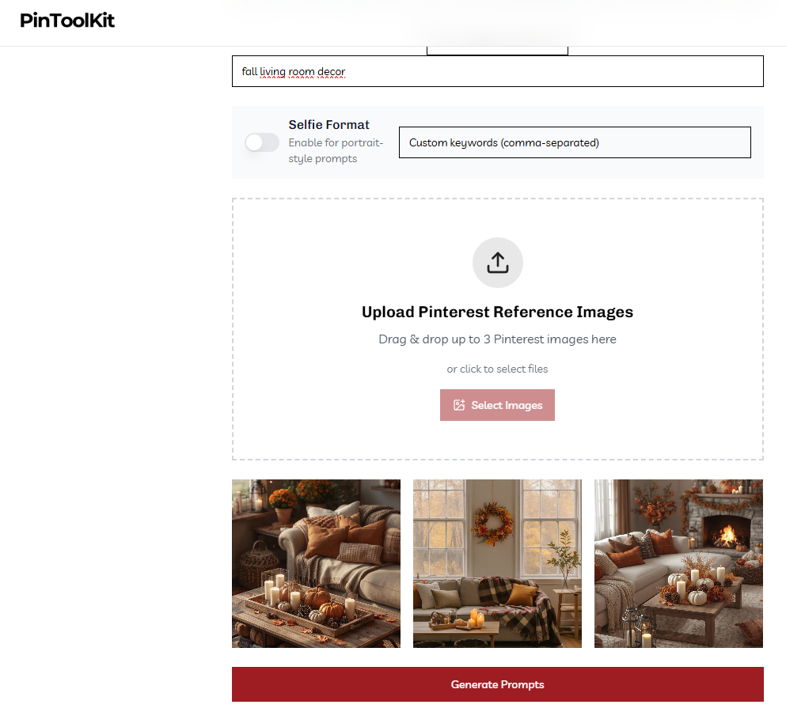
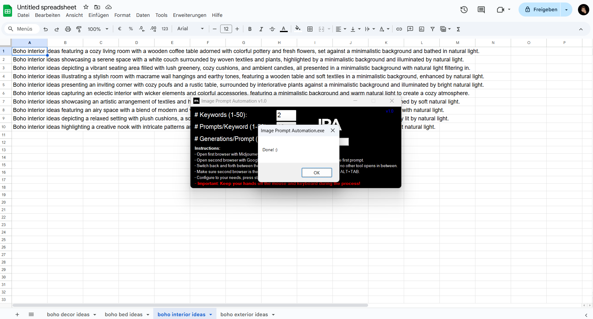
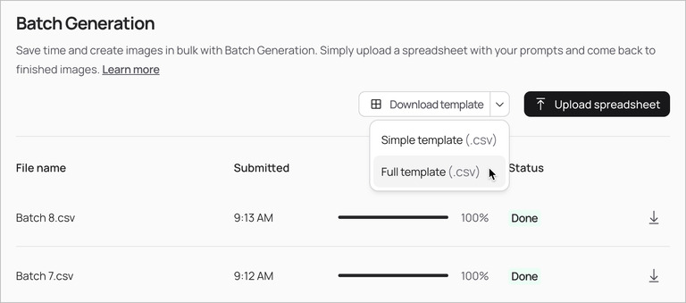
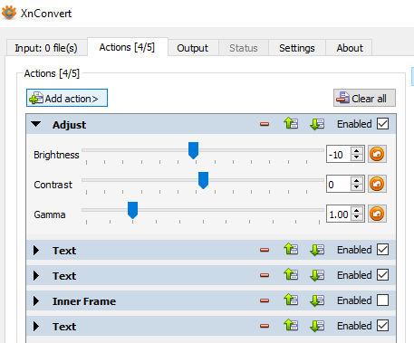
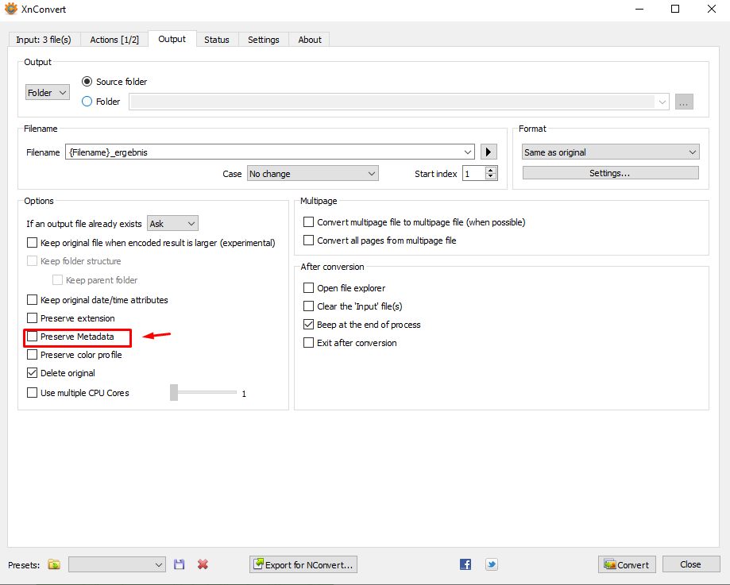

# 64-AI 图片自动化

## Page 1

**1) 从正确的风格开始（复制已经获胜的内容）**

1. 在隐身模式中打开 Pinterest → 搜索你的关键词 → 下载 3 个排名靠前的 Pin（你想要的相同外观/感觉）。
2. 在 PinToolKit → AI 图片提示词生成器中，上传这 3 张图片 → 点击生成为每个关键词获取 10 个优化的提示词。
   （这些高度优化以获得最佳的 Pinterest 灵感氛围和 Pin 风格）。
3. 将这些提示词粘贴到 Google 工作表中（标签页 = 关键词）。
   为你计划覆盖的尽可能多的关键词执行此操作——这使得后续步骤无需动手。

💡 为什么这很重要：你正在将你的 Pin 生成与已排名的兴趣集群对齐，这会改善 24-48 小时参与信号和下游分发。

**2) 免动手生成**

### 选项 A - Midjourney：

---

## Page 2

1. 在一个浏览器窗口中打开 midjourney.com → 创建。
   在另一个窗口中打开你的 Google 工作表。

2. 使用我们的图片提示词自动化自动生成图片

   ⚠️ 重要提示：我强烈建议在第二台 PC 上或在你不需要使用 PC 的时候运行自动化（例如，在睡觉前）。
   当自动化运行时，你的 PC 将被占用，你将无法使用它进行其他任务。

   在第二个浏览器窗口中打开 midjourney.com 并进入创建（提示：你可以用 ideogram.ai 做类似的事情，尤其是对于文字叠加 Pin）。

   使用复制我们的图片提示词自动化来高效地复制和处理提示词。

   图片提示词自动化.exe（983 KB）
   下载图片提示词自动化，启动它，并根据你的需求进行配置：
   关键词数量 = 工作表中标签页的数量
   每个关键词的提示词数 = 每个关键词有多少提示词（我们通常使用 10 个）
   每个提示词的生成数 = 每个提示词应生成多少图片

   确保带有 Midjourney 的浏览器窗口和带有 Google 工作表的浏览器窗口

---

## Page 3

然后，切换回图片提示词自动化工具并点击开始。
🚨 重要提示：当工具运行时，不要触摸键盘或鼠标！
该工具将最小化，并通过模拟键盘和鼠标操作自动将每个提示词从 Google 电子表格复制到 Midjourney。
一旦图片提示词自动化完成，你将收到一条简短的消息。
从此时起，你可以再次使用鼠标和键盘。

### 选项 B - Ideogram（原生批量工作流程）：

1. 登录 ideogram.ai。

---

## Page 4

2. 使用 Ideogram 的批量流程（我们更喜欢这个而不是外部自动化；它更稳定）。
   你只需要用你的提示词和设置填写他们的模板工作表——Ideogram 就会自动为你生成所有图片，无需逐个输入每个提示词。
   这超级方便，我们实际上更倾向于这种方式，而不是使用额外的外部自动化（我们也曾构建和测试过）。
   这确实是最简单的方法。

   唯一需要注意的是：你需要 Pro 版本（每月 60 美元）。
   但我的建议是获取一次 Pro，尽可能多地生成图片，然后取消。
   这样，你可以建立一个巨大的缓冲（因为你获得无限的慢速积分，可以在后台生成）。
   你可以轻松地将所有内容组织到你的 Google Drive 文件夹中，并提前几个月准备内容。

   💡 MJ 非常适合体量/纯图片。Ideogram 非常适合文字叠加密集的设计。

**3) 以干净的批次下载图片**

### 从 Midjourney：

1. 转到整理 → 滚动到最近的图片。
2. SHIFT-点击选择多个 → 下载（MJ 自动打包成约 50 张的 ZIP）。

### 从 Ideogram：

---

## Page 5

1. 转到创作 → 每组 4 张图片；勾选每组一张的白色复选框（或点击拖动进行多选）。
2. 点击下载（打包成 ZIP，最多 50/ZIP）。

   将 ZIP 移动到工作文件夹（为了简单起见，我们在 Windows 上使用 C:\Temp）。

**4) 批量解压和安全重命名 ZIP（一键）**

1. 将 rename_and_unpack.bat 复制到你的 ZIP 文件夹中（例如，C:\Temp）。
2. 双击运行 → 如果 Windows 警告，点击更多信息 → 仍然运行。
3. 它将自动重命名 ZIP（移除奇怪的字符）并提取所有。
   你将看到完成消息。
4. 你现在可以删除 ZIP 和 BAT 文件（如果以后需要，它们在回收站中）。

   Mac：该文件包括在终端中创建/运行 shell 脚本的 Mac 说明（touch、nano、chmod +x、然后 bash …）。
   按照课程中的片段使脚本可执行并在与你的 ZIP 相同的文件夹中运行它。

   你可以在此处更详细地查看此工作流程：
   https://www.pinscalesystem.com/view/courses/pindesignworkflow/3325446-tools- automation/10836398-script-package-unpack-high-amount-of-zip-files-shuffle-rename-files

**5) 在 XnConvert 中人性化 + 去除元数据**

1. 打开 XnConvert → 添加文件夹 → 选择你的工作文件夹（例如，C:\Temp）。
2. 在操作中，进行一些小的调整——如调整亮度和对比度，添加一点颗粒或纹理，也许还有微妙的光晕——足以稍微打破图片的完美。
3. 转到输出 → 取消勾选"保留元数据"（移除 EXIF、MJ 用户名、提示词）。

---

## Page 6

4. 点击转换 → 是。
   让它完成。

💡 为什么这很重要：Pinterest 模型不仅读取 EXIF；它们还检测合成模式（均匀光线、完美平滑的渐变、重复的边缘几何）。
受控的微不完美 + 元数据清理使输出扫描为有机。

**6) 在 XnConvert 中自动文字叠加（可选）**

仍在 XnConvert 中，设置带有响应于 9:16 的动态放置的叠加文字。
你也可以将此保存为模板以标准化标题放置。

---

## Page 7

**7) （可选）同步到 Google Drive 桌面版**

1. 安装 Drive 桌面版 → 登录（你获得一个 G: 驱动器）。
2. 将你的上传就绪关键词文件夹复制到你的 Drive 中。
3. 检查 Drive 图标以获取同步状态。
4. 当它显示成功时，你可以安全地清理本地临时以保持你的机器轻量。

**结果：**
你现在拥有上传就绪的 AI 图片文件夹，它们看起来像人类，已清理，有标题/叠加（如果你选择），并按关键词整齐命名。

---
