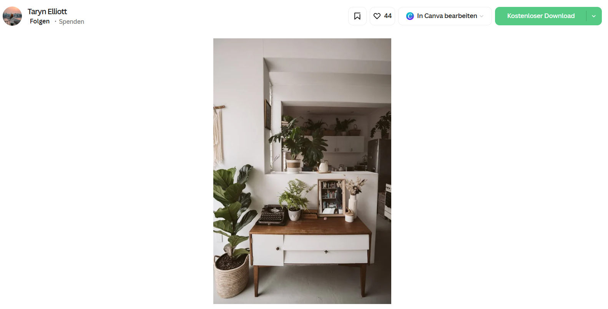
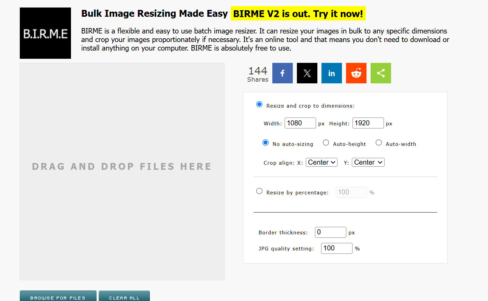
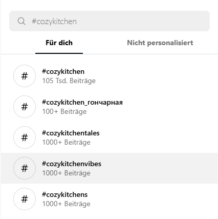
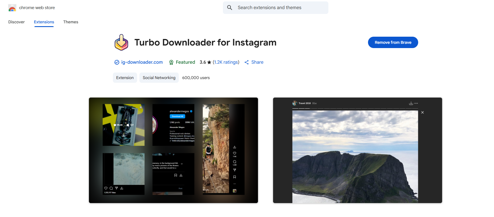

# 65-真实图片工作流程

## Page 1

**A1) 选择正确的库存来源（2-3 分钟）**

在浏览器中打开 Pexels 或 Unsplash。
许多"普通"人（不仅仅是专业人士）也在那里上传他们的照片，所以图片往往看起来更真实，并且自然地更好地匹配 Pinterest 的美学。
由于这些平台上的搜索功能并不总是非常精确，我通常使用更广泛的术语——接近关键词，但不要太具体。
例如，不用'秋季客厅装饰'，而只搜索'客厅'或'客厅装饰'。
这帮助我找到具有正确氛围的图片，然后平台会建议更多类似的图片。

例如，我遇到了这张图片——它是纵向的，完全匹配 Pinterest 美学。
在下面，我找到了很多类似的图片，我总是喜欢访问创作者的个人资料，看看他们是否有更多很棒的、相关的内容。
专业提示：如果你找到具有很棒氛围和大量很棒内容的创作者——关注他们。
这可以轻松找到你的细分领域中的新精彩图片（尤其是如果他们专注于与你相同的细分领域）。

### 要寻找什么（将此清单放在你旁边）：

柔和、自然的光线（没有强烈的工作室光线）
轻微的纹理/颗粒、小的不完美（褶皱、不均匀的阴影、真实生活的微小杂乱）
感觉可实现、而不是为广告摆拍的构图
干净、自然的美学——就像用 iPhone 或"美学"滤镜拍摄的一样

**A2) 下载你的选择（1-2 分钟）**

在 Pexels/Unsplash 上，如果可能，下载垂直友好的图片（省去稍后的裁剪）。

---

## Page 2

**A3) 批量转换为 Pinterest 的首选尺寸（1080×1920）（2-5 分钟）**

转到 Birme（简单的免费调整大小工具 - https://v1.birme.net/）→ 设置 1080×1920（9:16）→ 拖放你的图片 → 一次性导出。
这是 Pinterest 的最佳 Pin 格式。

**A4) 使用 XnConvert 批量"使其看起来像人类" + 清理元数据（5-8 分钟）**

为库存图片赋予 Pinterest 的原生感觉并去除元数据。

**A6) 使用 XnConvert 批量"使其看起来像人类" + 清理元数据（5-8 分钟）**

1. 安装并打开 XnConvert。
   点击输入 → 添加文件夹并选择你调整大小的图片。

### 2. 转到操作并创建一个一次性配方：

亮度/对比度优先（非常小的调整）。
添加轻微颗粒 / 纹理（微妙的噪点或纹理层；微小量）。
可选：轻微光晕（非常微妙）。
可选：文字叠加（如果此 Pin 将是标题驱动的）。
（亮度优先，然后叠加——这样你的文字不会被后续编辑冲淡。）

这些编辑使你的 Pin 看起来更像人类且更加优化。
随意在 XnConvert 中尝试并设置几个模板。
我们现在有几个用于不同细分领域和风格——所以我们只需放入图片，它会自动为我们生成所有文字叠加。

---

## Page 3

3. 转到输出并取消勾选"保留元数据"。
   点击转换 → 是。
   （移除嵌入信息；保持你的图片精简和一致。）

**A7) （可选）同步到 Google Drive → 准备上传（1-2 分钟）**

安装 Google Drive 桌面版并在那里组织所有你的 Pin。
你现在拥有来自库存图片的 Pinterest 就绪 Pin：垂直、人性化、轻微纹理、可选标题、干净命名、为上传而组织。

**PART B - INSTAGRAM 图片 → PINTEREST 就绪（分步）**

**预先说明：**
这条路线对于真实、人性化美学效果很好——但它是灰色地带。
你必须署名创作者，并且存在版权风险。
你建议先尝试 AI（更高效）；如果使用 IG，请谨慎进行，尽可能请求许可，并构建小型创作者网络以便持续使用。

**B1) 准备你的 IG 获取账户（3-5 分钟）**

创建一个新的 IG 账户，仅用于关注你细分领域中的创作者。
这为相关发现训练你的主页源。
使用细分领域话题标签发现更多创作者（例如，#c、#slowfashionoutfits、#minimaldesk）。

---

## Page 4

**B2) 查找值得保存的图片**

使用与库存图片完全相同的视觉清单（柔和光线、轻微颗粒、可实现的外观、手机风格）。
下载匹配 Pinterest 灵感氛围的图片。

**B3) 下载图片（1-3 分钟）**

使用你首选的 Chrome 扩展程序从帖子下载图片。
单张图片：打开它，然后点击扩展程序。
轮播：扩展程序可以一次下载所有幻灯片。
我喜欢使用这个：https://chromewebstore.google.com/detail/turbo-downloader-for- inst/cpgaheeihidjmolbakklolchdplenjai?hl=en&pli=1

---

## Page 5

**B4) 署名 + 许可（重要）**

在你的 Pin 描述中，添加"署名：@创作者姓名"或"所有者：@创作者姓名"。
如果你计划使用来自同一创作者的许多图片，请请求许可并考虑一个简单的持续宣传换使用协议（10 个创作者是一个很好的"网络甜蜜点"）。

**B5) 转换为 1080×1920（2-5 分钟）**

如果图片不是垂直的，使用 Birme 批量调整大小/裁剪为 1080×1920（拖放，导出）。
（与库存相同的大小调整逻辑。）

**B6) 使用 XnConvert（5-8 分钟）**

我在这里也真的很喜欢做的一件事是添加文字叠加。
使用 XnConvert，你甚至可以在 Pin 本身上的小文本框中包含创作者的姓名——这可以为你节省一些时间，因为如果你愿意，你可以将其从描述中省略。
一个小提示：你的文字叠加越大越引人注目，背景图片就变得越不重要。
当然，如果创作者不喜欢他们的图片被使用，这并不能完全保护你，但例如，稍微降低亮度可以帮助稍微降低这种风险。

---
