# 66-完整的 AI 图片工作流程 SOP

## Page 1

**从你的概览工作表为每个关键词高效创建新图片的步骤：**

1. 使用我们的 AI 图片提示词生成器生成 Midjourney 提示词，并将它们保存到 Google 电子表格，每个关键词一个标签页。
2. 使用我们的图片提示词自动化生成 AI 图片。
3. 从 Midjourney 下载生成的图片。
4. 解压 zip 文件并将图片组织到文件夹中。
5. 使用 xnConvert 后处理图片。
6. 打乱并重命名文件。
7. 将图片上传到 Google Drive。

**步骤 1：生成 Midjourney 提示词**

在隐身标签页中打开 Pinterest。
输入你想要生成图片的关键词。

---

## Page 2

下载排名前 10 的 3 张图片。
打开 AI 提示词生成器，如果尚未完成，配置你的 API 密钥，并将 3 张图片上传到生成器中。
点击"生成提示词"开始提示词生成。
不到一分钟，你将收到 10 个像这样的提示词。

---

## Page 3

点击"复制全部"复制生成的提示词。
打开现有的或新的 Google 电子表格。
将复制的提示词粘贴到电子表格中并重命名该工作表以获得更好的组织。

---

## Page 4

为尽可能多的关键词生成尽可能多的提示词，以使后续步骤更加高效！

**步骤 2：使用我们的图片提示词自动化生成图片**

**注意：** 我强烈建议在第二台 PC 上或在你不需要使用计算机的时候运行自动化——例如，在睡觉前启动它。
当自动化运行时，你的 PC 将被阻止，无法将其用于其他任务。

在第二个浏览器窗口中打开 midjourney.com 并进入创建（提示：你可以用 ideogram.ai 做类似的事情，尤其是对于文字叠加 Pin）。

---

## Page 5

**图片提示词自动化.exe（983 KB）**

下载图片提示词自动化，启动它，并根据你的需求进行配置：

- 关键词数量 = 工作表中标签页的数量
- 每个关键词的提示词数 = 每个关键词有多少提示词（我们通常使用 10 个）
- 每个提示词的生成数 = 每个提示词应生成多少图片

确保带有 Midjourney 的浏览器窗口和带有 Google 电子表格的浏览器窗口是你打开的最后两个窗口，Google 电子表格是最后一个。
然后，切换回图片提示词自动化工具并点击开始。

🚨 重要提示：当工具运行时，不要触摸键盘或鼠标！
该工具将最小化，并通过模拟键盘和鼠标操作自动将每个提示词从 Google 电子表格复制到 Midjourney。
一旦图片提示词自动化完成，你将收到一条简短的消息。
从此时起，你可以再次使用鼠标和键盘。

---

## Page 6

如果你是 Midjourney 或 Ideogram 的新手，请查看我们的 Midjourney SOP 或 Ideogram SOP 以获取详细指南。

**步骤 3：从 Midjourney 下载图片**

**专业提示：** 按每个关键词批量下载图片。这使得后续处理更加容易，因为你无需稍后对它们进行排序（见步骤 4）。

### 如果你使用的是 Midjourney：

转到"整理"并滚动到你最近生成的图片。
通过按住鼠标左键或在单击每张图片时按 SHIFT 来选择你想要下载的所有图片。

---

## Page 7

完成后，点击"下载"，所有图片将被打包成 ZIP 文件（每个文件 50 张图片）。

### 如果你使用的是 Ideogram：

转到"创作"并滚动到你最近生成的图片。
图片按四张一组分组，因此每组只需选择一张图片。
要下载多张图片，左键单击每组中一张图片上的白色复选框。
或者，在图片下方左键单击，按住点击并拖动以一次选择多张图片。
完成后，点击"下载"，所有图片将被打包成 ZIP 文件（每个文件最多 50 张图片）。

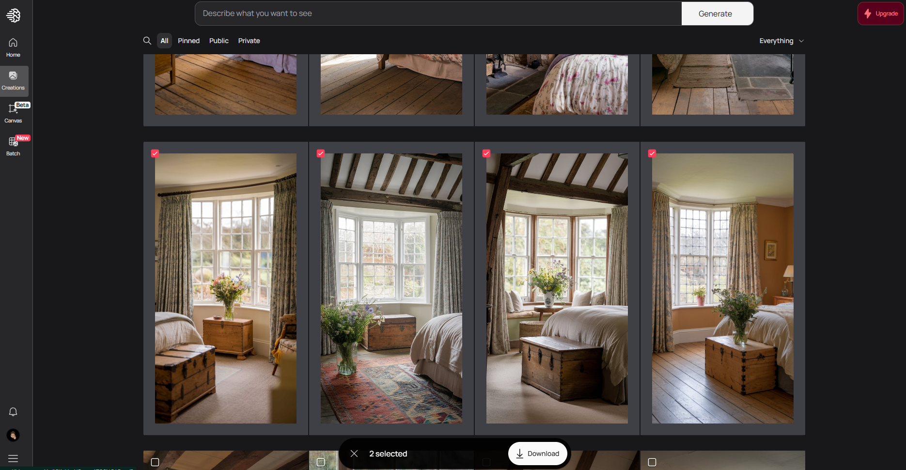

---

## Page 8

将下载的 ZIP 文件移动到你要处理它们的指定文件夹——我们建议使用 C:/Temp 以便于访问。

**步骤 4：解压你的图片并将它们排序到文件夹中**

使用你选择的 ZIP 工具解压所有 .zip 文件，或者通过使用我们的批处理文件节省时间以进行批量

### 提取：

1. 下载批处理文件 "rename_and_unpack.bat"

---

## Page 9

2. 将其复制到存储所有 ZIP 文件的同一文件夹中（例如，C:/Temp）
3. 运行批处理文件，第一次你可能会收到警告，点击"更多信息"。

---

## Page 10

4. 点击"仍然运行"

---

## Page 11

5. 批处理文件将通过从文件名中删除特殊字符来自动重命名所有 .ZIP 文件（以防止任何问题），然后提取所有 ZIP 文件。
6. 过程完成后，你将在命令行窗口中看到确认消息。

---

## Page 12

7. 你现在可以删除所有 ZIP 文件和 "rename_and_unpack.bat" 文件，因为下一步不再需要它们。
   如果以后需要，你可以在回收站中找到它们。

   如果需要，将你的图片排序到以概览工作表中相应关键词命名的文件夹中以便于处理。

**步骤 5：使用 xnConvert 后处理图片**

下载 xnConvert（https://www.xnview.com/en/xnconvert/#downloads），安装并启动它

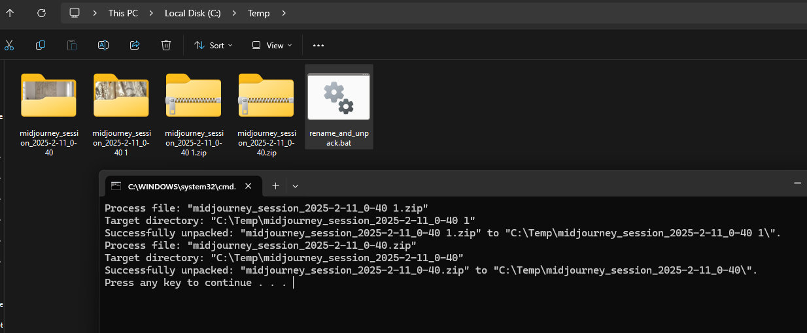

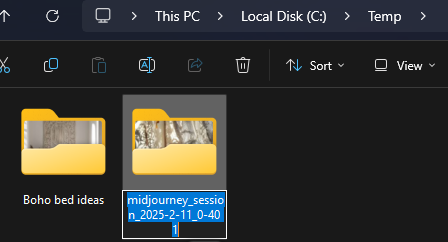

---

## Page 13

点击"添加文件夹"，选择你的工作文件夹（例如，C:/Temp），然后点击"选择文件夹"。
xnConvert 将显示图片的总数，允许你验证一切是否正确。

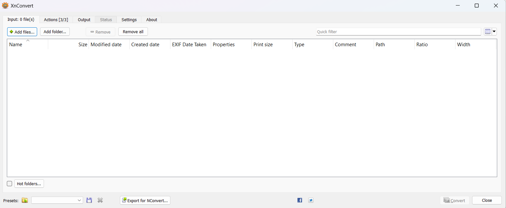

---

## Page 14

### 配置输出设置：

导航到"输出"选项卡并如图所示进行配置。
重要提示：取消勾选"保留元数据"复选框，以确保 xnConvert 删除任何不需要的数据（例如，Midjourney 用户名、提示词）。
点击"转换"，用"是"确认，xnConvert 将开始处理。

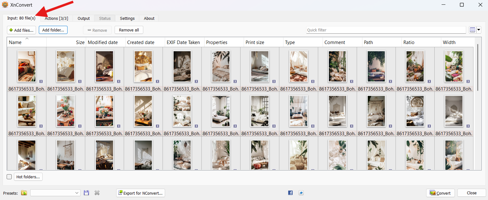

---

## Page 15

xnConvert 现在将所有图片转换为新文件，同时去除任何不必要的元数据。

**步骤 6：打乱和重命名文件**

为了防止太多类似的图片按顺序出现，最好在每个关键词文件夹中打乱图片。
此外，文件名需要重命名，因为它们包含不必要的细节，如 Midjourney 用户名和提示词。

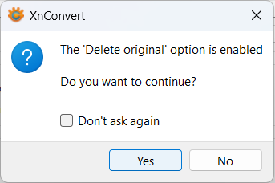

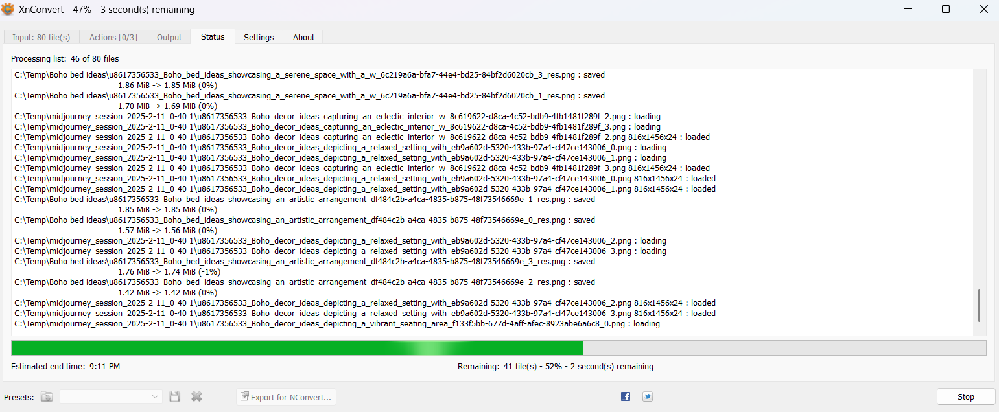

---

## Page 16

### 此脚本的作用：

它进入每个子文件夹。
它打乱内部的所有图片。
它根据子文件夹名称（= 关键词）重命名它们。
它为它们重新编号以获得更自然和干净的结构。

**shuffle_and_rename_files_in_subfolders.bat（3.6 KB）**

### 如何使用它：

1. 下载批处理文件 "shuffle_and_rename_files_in_subfolders.bat"。
2. 将文件复制到所有 ZIP 文件所在的同一文件夹中（例如，C:/Temp）。
3. 运行批处理文件。
4. 如果第一次收到安全警告，点击"更多信息"并继续。

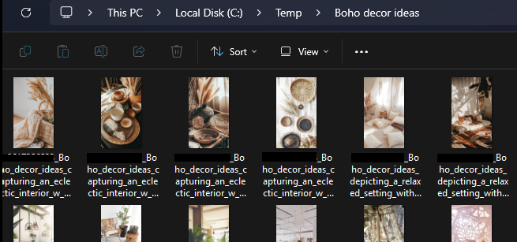

---

## Page 17

5. 然后点击"仍然运行"

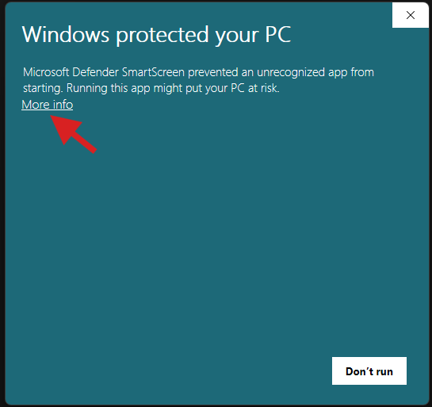

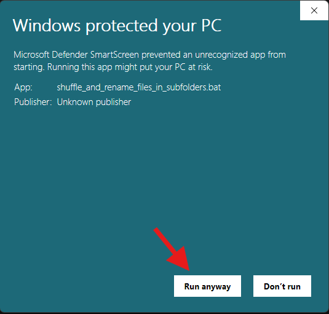

---

## Page 18

6. 7. 现在你拥有一个很棒的结果，准备好用于 Pinterest。

**步骤 7：将图片上传到 Google Drive**

而不是逐个直接将每个完成的图片上传到 Pinterest，更高效的方法是先将它们全部上传到 Google Drive。
这样，你和你的团队将所有图片存储在一个中央位置以便于访问。

下载并安装 Google Drive 桌面版并将其连接到你的 Google 账户。
安装后，你的 PC 上将出现一个新的驱动器（通常是 G:）。

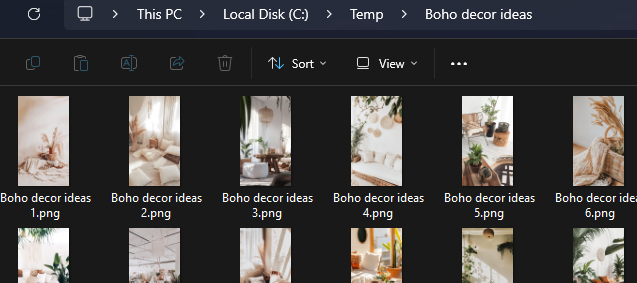

---

## Page 19

**复制文件**

将完成的图片文件夹（来自步骤 3）移动到你的本地 Google Drive 文件夹中。

**自动上传**

Google Drive 桌面版将自动同步文件到你的云存储。
要检查上传状态，点击 Google Drive 图标。

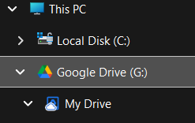

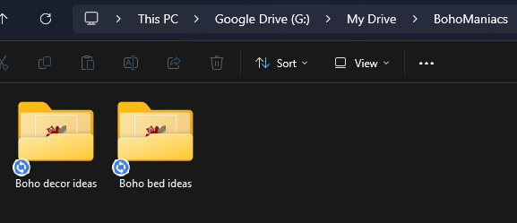

---

## Page 20

如果你看到这个成功消息，说明一切已成功传输。

---

## Page 21

**清理**

一旦上传完成，你可以安全地从本地工作文件夹（例如，C:/Temp）中删除所有文件。

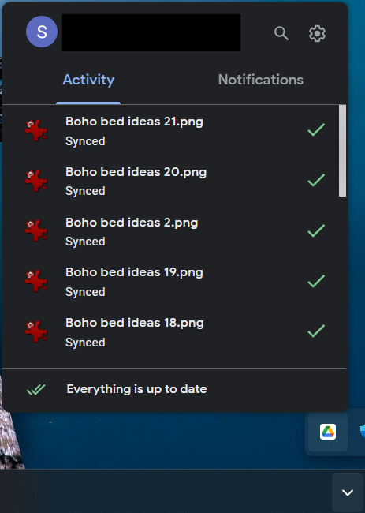

---
