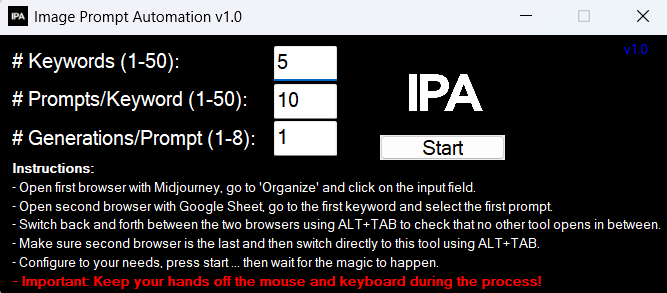

# 不幸的是，Midjourney 不提供用于生成和下载图像的 API。这意味着我们必须使用浏览器中的用户界面（或在 Discord 中）

---

## 文档摘要

**Source File**: 20-Image_Prompt_Automation.pdf
**Converted**: 2026-02-02 07:04:33

## 内容预览

- 不幸的是，Midjourney 不提供用于生成和下载图像的 API。这意味着我们必须...
- 使用浏览器中的用户界面（或在 Discord 中）...
- 那么 Automation 到底为你做了什么？...

---

# 内容

不幸的是，Midjourney 不提供用于生成和下载图像的 API。这意味着我们必须使用浏览器中的用户界面（或在 Discord 中）。

### 那么 Automation 到底为你做了什么？

这个 Automation 模拟用户操作 - 特别是鼠标点击和键盘输入。在这种情况下，过程遵循一个简单的顺序：

1. 复制所选单元格的内容
2. 切换到带有 Midjourney 的浏览器
3. 粘贴 Prompt
4. 移动到下一个 Prompt（电子表格中的下一行）
5. 重复直到达到最大 Prompt 数量
6. 移动到下一个关键词
7. 所有关键词处理完成后，Automation 停止

### 我们如何使用 Image Prompt Automation：

注意：我强烈建议你在第二台 PC 上运行 Automation，或者在你不需要计算机的时候运行 - 例如，在睡觉前启动它。

当 Automation 运行时，你的 PC 将被锁定，无法用于其他任务。

在第二个浏览器窗口中打开 midjourney.com 并转到"Create"（提示：你可以用 ideogram.ai 以类似方式执行此操作，特别是对于文字叠加 Pin）。

使用复制我们的 Image Prompt Automation 来高效复制 Prompt。

### 下载 Image Prompt Automation

下载 Image Prompt Automation，启动它，并根据你的需要进行配置：

### 关键词数量 = 你的 Sheet 中的标签页数量

每个关键词的 Prompt 数 = 每个关键词有多少个 Prompt（我们通常使用 10 个）

每个 Prompt 的生成数 = 每个 Prompt 应生成多少图像

确保带有 Midjourney 的浏览器窗口和带有 Google Spreadsheet 的浏览器窗口是你打开的最后两个窗口，Google Spreadsheet 是最后一个。

然后，切换回 Image Prompt Automation 工具并点击 Start。

### 重要：工具运行时不要触摸键盘或鼠标！

工具将最小化并通过模拟键盘和鼠标操作自动将每个 Prompt 从 Google Spreadsheet 复制到 Midjourney。

一旦 Image Prompt Automation 完成，你将收到一条短消息。从此时起，你可以再次使用鼠标和键盘。

### 常见问题

### 按 ESC 暂停 Automation。

### 故障排除：Midjourney 在 Relax 模式下"双重批处理"

错误："Job action restricted. You can not submit batch jobs in relax mode."（作业操作受限。你不能在 relax 模式下提交批处理作业。）

Sheet 中的第一行似乎发布了两次。

### 快速修复：

1. 使用 Fast 模式进行重复运行
在每个 Prompt 中添加 --fast（推荐），或在开始前运行 /fast。

2. 如果你想保持 Relax
### 将 Generations/Prompt = 1 设置为不发送重复。

## 文档图像

