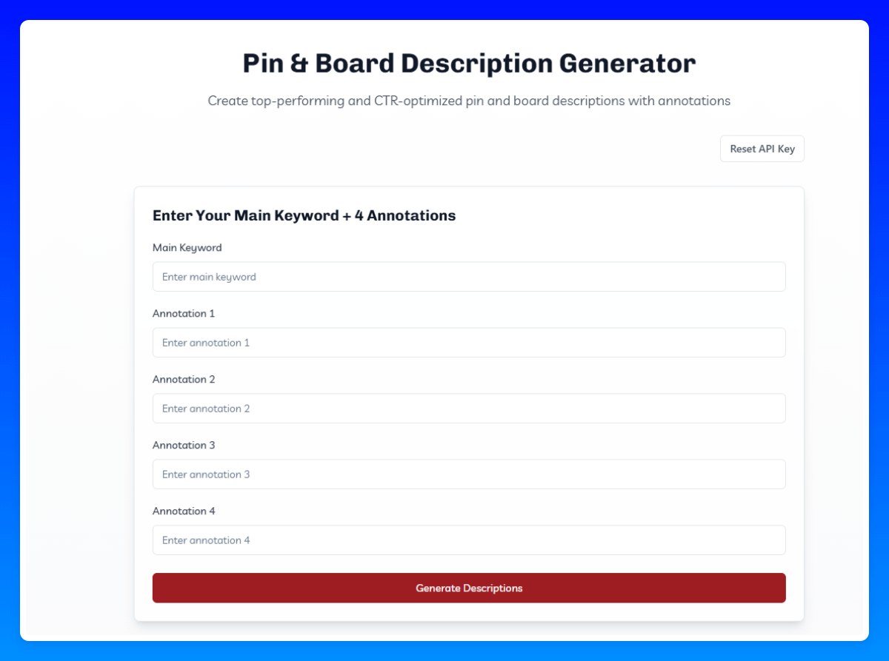

# 一次性创建顶级表现和 CTR 优化的带有注释的 Pin 和 Board 描述

---

## 文档摘要

**Source File**: 22-Pin_&_Board_Description_Generator.pdf
**Converted**: 2026-02-02 07:04:33

## 内容预览

- 一次性创建顶级表现和 CTR 优化的带有注释的 Pin 和 Board 描述...
- 只需输入你的主关键词 + 4 个注释，工具就会自动创建你优化的 Board + ...
- 描述...

---

# 内容

一次性创建顶级表现和 CTR 优化的带有注释的 Pin 和 Board 描述。

只需输入你的主关键词（Main KW）+ 4 个注释，工具就会自动创建你优化的 Board + Pin 描述。

你可以在这里了解如何获得 4 个注释。

### 注意：

这是最有效的方法之一，我也喜欢称注释为"Pinterest 增强版"。

我强烈建议你对每篇文章/关键词都仔细执行此操作，并定期将 Board 描述添加到你的 Pinterest Board。出于效率原因，我通常每周一次（通常是周日）将它们添加到 Board。但你也可以在每次创建新 Board 时添加它们。

Pin 描述还在每个描述的末尾包含小的 CTA（行动号召），如"read more"（阅读更多）或"save now"（立即保存），以提高你的 CTR。

## 文档图像

