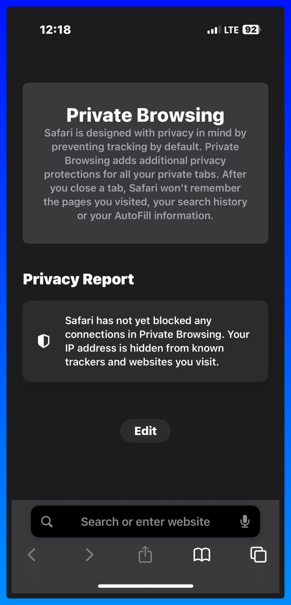

## 文档摘要

**Title**: 安全创建新账户
**Category**: 账户安全
**Source**: NicheGrowNerd Pin Scale System

**概述**:
本文档是 Pin Scale System 账户安全模块（第 07 部分）的一部分。它提供了安全高效管理 Pinterest 账户的基本指南和最佳实践。

---

## 内容

### 如何在创建新账户时降低被封禁的风险：

如果你想以最低的封禁风险创建一个新账户，请按照以下方法操作：

1. 使用 iPhone 或 iPad（这背后的逻辑是，大多数垃圾邮件发送者不使用 iPhone 或 iPad 来做这个 ）
2. 连接 5G 网络（不使用 VPN）
3. 在隐私标签页中打开 Safari（如果你订阅了 iCloud，这会自动激活 Private Relay）

### 4. 打开 Pinterest.com 并创建一个新的个人账户（不要立即创建商业账户！）

### 5. 等待 1-2 天，然后将你的账户切换为商业账户

我在不同设备、浏览器上、使用代理和 VPN 以及不使用的情况下无数次测试了这种方法。这是迄今为止最安全的方式。

### 额外思考与观察：

最近，我在 X 上看到相当多**封禁账户**的截图——通常与通过第三方工具上传的 Pin 有关，或者来自用户报告 AI 生成的 Pin。
似乎 Pinterest 对第三方调度器变得更加敏感了。
所以我强烈推荐使用 Pinterest 原生调度器。

### 我的经验：

我很久没有被封禁了，但当我定期使用 Tailwind 时，有些账户确实会时不时被标记。
一次性发布太多也是如此——如果你每天上传**超过 48 个 Pin**，特别是在**较新的账户**（1 岁以下）上，被标记的几率会大大增加。

### 为什么 Pinterest 要打击垃圾邮件

我认为 Pinterest 正在加倍加强垃圾邮件过滤，因为**AI 大幅增加了平台上的活动**——随之而来的是一波垃圾邮件发送者。
你仍然可以使用 AI 图像——但它们需要是**高质量的**。
我们会过滤掉任何不符合我们标准的内容。
这些天，通过训练 Midjourney 或 Ideogram 并尝试不同的提示词可以获得更好的结果——其中一些效果出奇地好。
