## 文档摘要

**Title**: 我们的浏览器设置：安全高效管理账户
**Category**: 账户安全
**Source**: NicheGrowNerd Pin Scale System

**概述**:
本文档是 Pin Scale System 账户安全模块（第 07 部分）的一部分。它提供了安全高效管理 Pinterest 账户的基本指南和最佳实践。

---

## 内容

### 问题

管理多个 Pinterest 账户可能很麻烦——需要不断登录和登出，特别是当你的站点数量增长时。

### 解决方案

使用 Firefox 浏览器创建独立的配置文件，允许你**同时管理多个 Pinterest 账户**而无需登录和登出。

### 你需要什么

- Firefox 浏览器 在此下载
- Firefox 附加组件：Firefox Multi-Account Containers
- （可选但推荐）用于不同浏览器配置文件的代理或 VPN（我最多为 10 个账户使用 1 个 VPN 配置文件）。

### 实际效果

你的桌面或专用文件夹中会有不同 Firefox 配置文件的快捷方式。
每个浏览器快捷方式都会打开一个不同的 Firefox 配置文件，其中你所有的 Pinterest 账户已经在多个标签页中登录。
这样，你可以无缝管理每个账户，无需登录和登出。
最好的设置是为每个账户将 "Pin Builder" 页面加入书签，这样每次打开配置文件时它都会自动打开。

### 步骤 1：创建 Firefox 配置文件

1. 下载并安装 Firefox 浏览器。
2. 在 Firefox 浏览器中，在地址栏中输入 "about:profiles" 并单击 "Create a New Profile"。

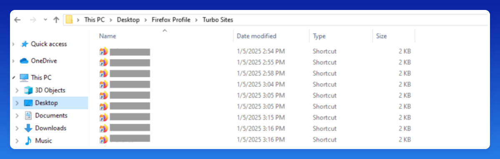

### 1. 单击 "Next"。

2. 输入配置文件名称并单击 "Finish"。
3. 在 "about:profiles" 下，你现在可以查看和管理你的 Firefox 配置文件。但是，我们暂时还不需要它们。

### 步骤 2：创建 Firefox 快捷方式以便快速访问（Windows + Mac 替代方案）

步骤 2 是 Windows 专用的（步骤 3 适用于 Mac 和 Windows）。如果此方法在 Mac 上不起作用，你可以跳过此步骤，并通过 Firefox 中的 "about:profiles" 手动打开你的配置文件。为了加快访问速度，请在浏览器中为 "about:profiles" 添加书签，然后继续执行步骤 3。

1. 在你喜欢的位置创建一个 Firefox 快捷方式：右键单击 新建 快捷方式。
2. 单击 "浏览" 并找到 Firefox 应用程序。
3. 文件路径应如下所示：

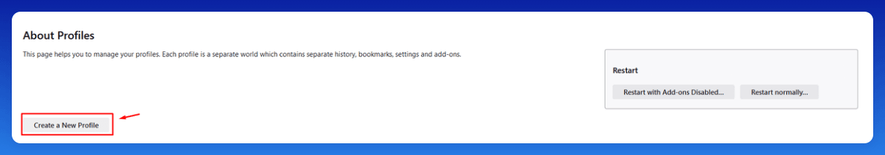

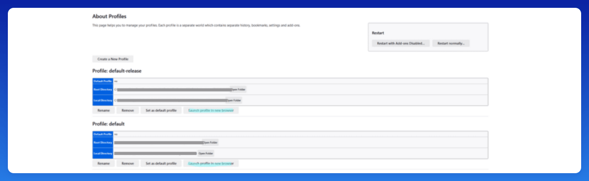

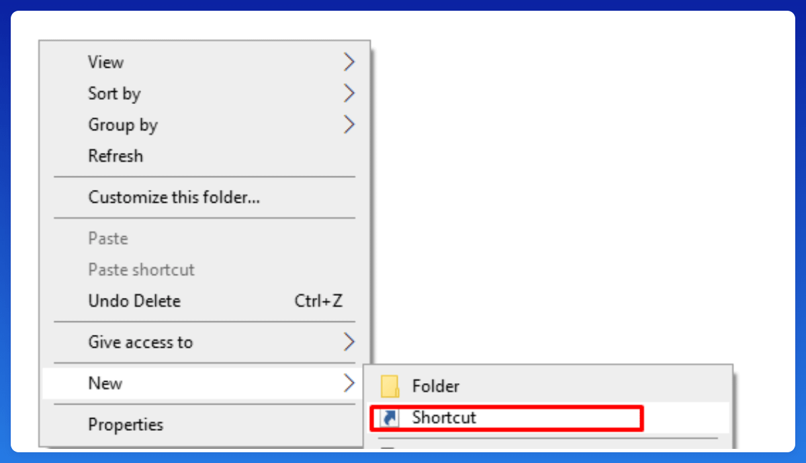

### 4. 为你的配置文件快捷方式命名，然后单击 "完成"。

5. 你现在已创建了一个快捷方式。为了确保它打开正确的 Firefox 配置文件，我们需要将其分配给相应的配置文件。
6. 右键单击快捷方式并转到 "属性"。
7. 在 "目标" 下，按如下方式修改文本：
   从：
   "C:\Program Files\Mozilla Firefox\firefox.exe"
   到：
   "C:\Program Files\Mozilla Firefox\firefox.exe" -p your-profile-name -no-remote
   确保在 "-p" 之前留一个空格，并正确放置引号。

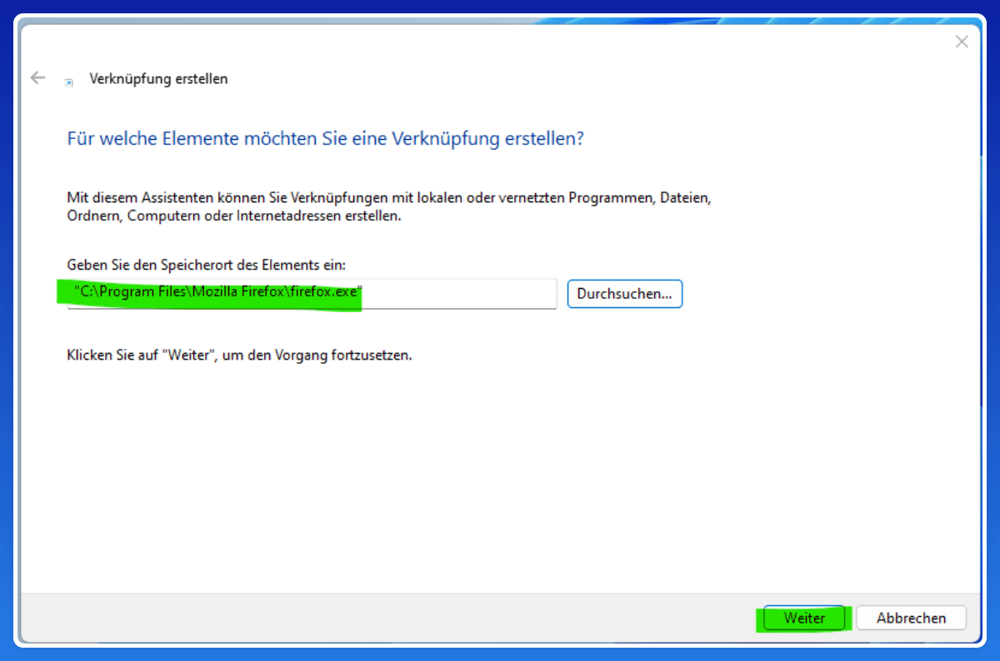

### 8. 单击 "应用"。

9. 启动快捷方式，分配的 Firefox 配置文件将打开。现在，让我们在步骤 3 中设置 Pinterest 账户。

### 步骤 3：安装并设置 Firefox Multi-Account Containers

1. 安装 Firefox Multi-Account Containers 扩展。
2. 将扩展固定到浏览器工具栏以便快速访问。

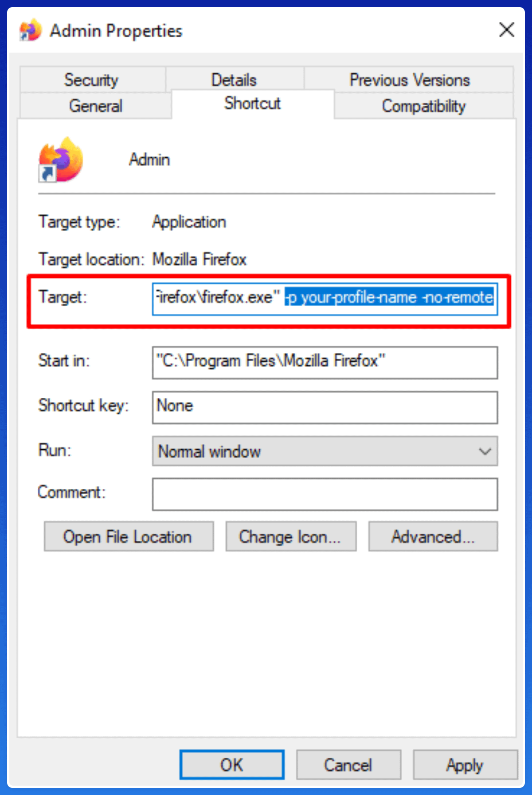

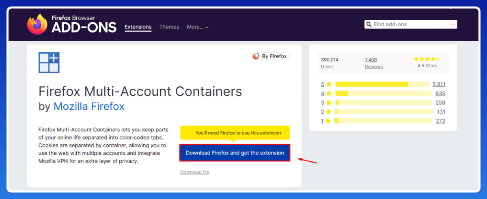

### 3. 按照设置步骤操作，并在出现提示时单击 "Not Now"。

4. 再次单击 "Not Now"，除非你使用的是 Mozilla VPN（此设置不需要）。
5. 默认情况下，该扩展包括四个容器标签页。要自定义它们，请单击 "Manage Containers" 并为你的 Pinterest 账户创建单独的容器。

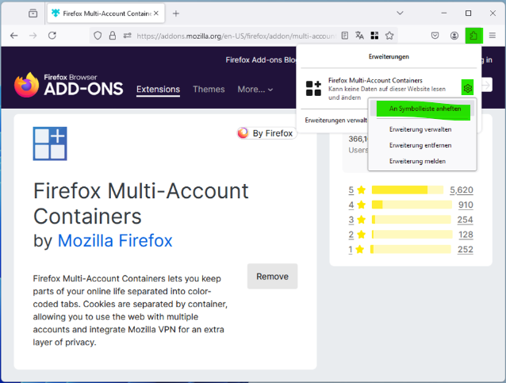

### 6. 单击每个容器以在单独的标签页中打开 Pinterest 账户——每个都有自己的会话。这意味着你可以登录多个账户而不会相互干扰。

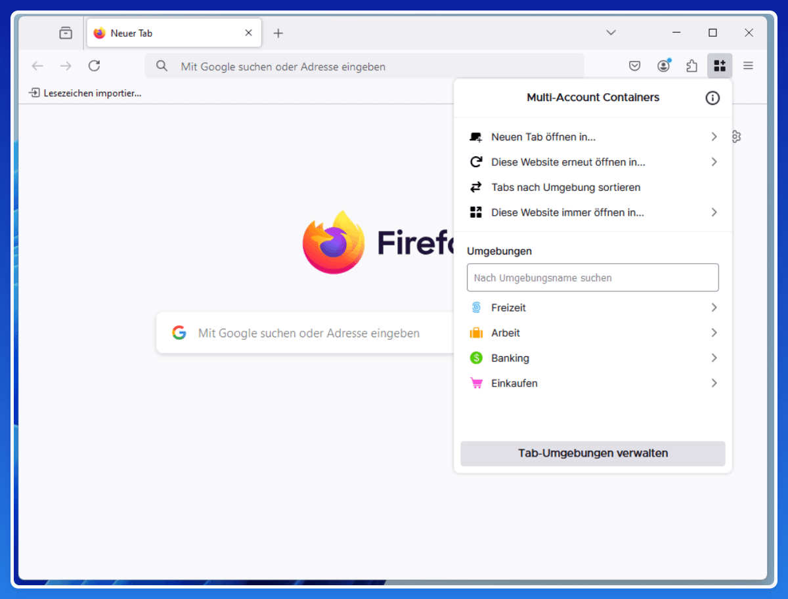

### 7. 打开 Firefox 设置。

8. 启用 "打开以前的窗口和标签页"，以便所有标签页在 Firefox 启动时自动重新加载正确的 Pinterest 账户。
9. 在下次启动浏览器时，所有帐户都将准备就绪。理想情况下，将每个标签页设置为打开 "Pin Builder" 页面，这样你就可以快速一次将 Pin 上传到多个账户。

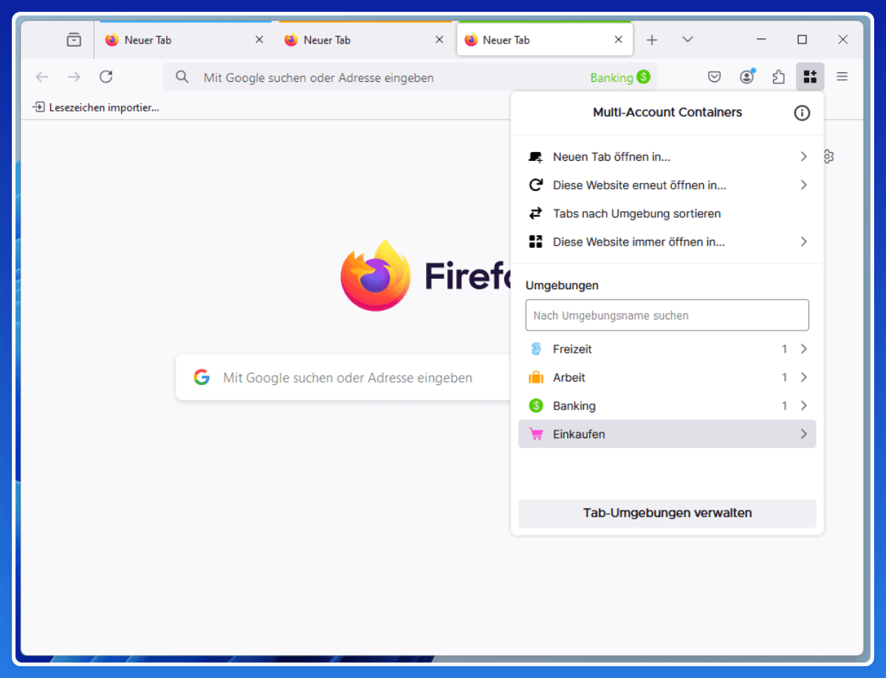

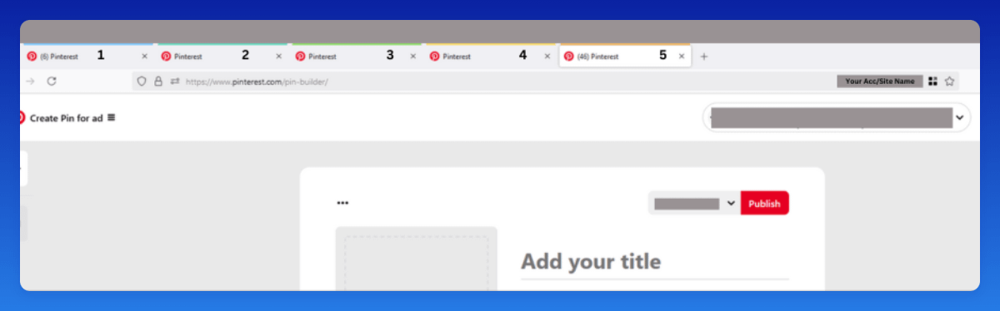
