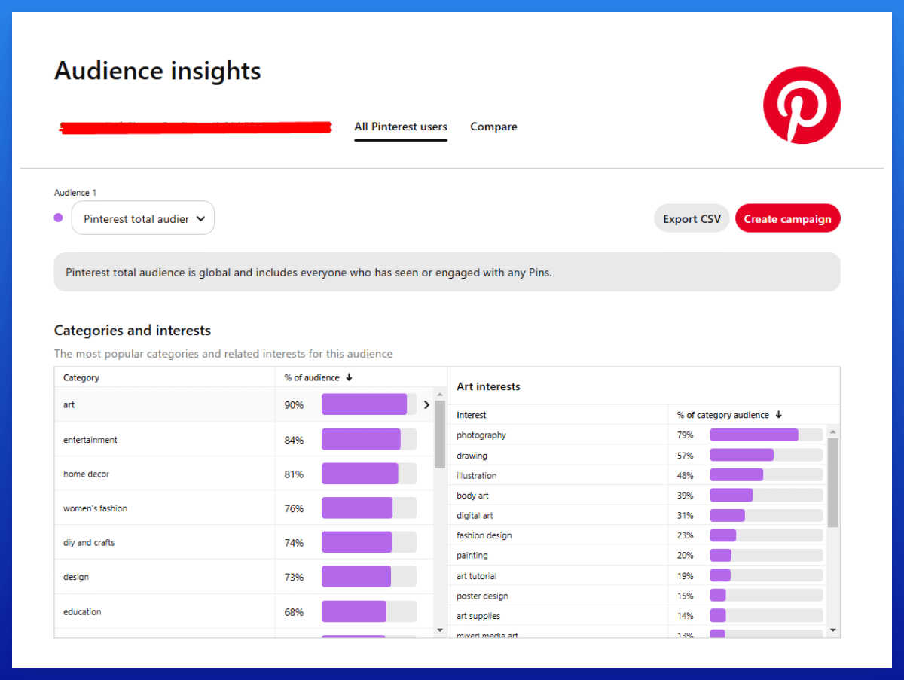
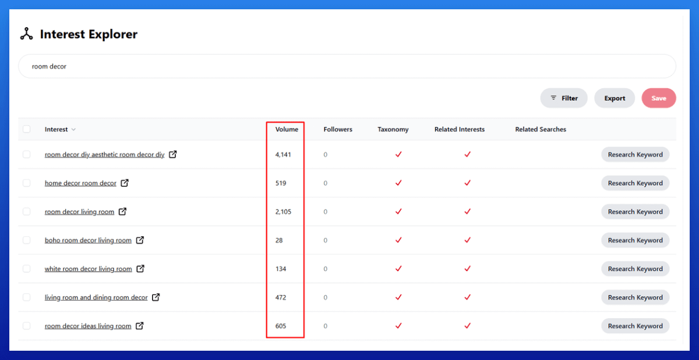
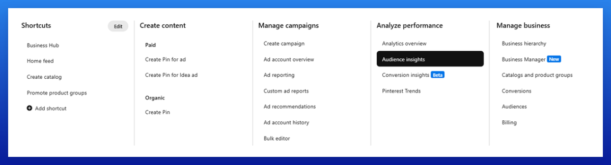

# 第二步：细分领域和关键词研究 SOP

这是研究细分领域和进行出色 KW 研究的整体流程。

选择正确的细分领域为长期成功奠定基础，并确保你拥有 50-100 个强关键词的稳定储备。

## 关键定义：

**Niche（细分领域）**：你针对的特定市场细分（例如，Home Decor 家居装饰、DIY & Crafts DIY 和手工艺）。

**Keyword (KW)（关键词）**：用户在 Pinterest 上输入的搜索词或短语。

## 细分领域研究 SOP：

前往 Pinterest > 受众洞察

前往 '*All Pinterest Users*' 并查看不同的类别及其兴趣。
寻找足够大的可以围绕其建立专门网站的类别。

一个细分领域应该足够大，能够为文章提供 50-100 个强关键词，并且应该提供多样化的子主题。

### 这是我十大细分领域：

Fashion（时尚）

Art & Design（艺术与设计）

Beauty（美容）

Home Decor（家居装饰）

DIY & Crafts（DIY 和手工艺）

Wedding（婚礼）

Food & Recipes（美食和食谱）

Architecture（建筑）

Parenting（育儿）

Gardening（园艺）

## 关键词研究 SOP：

在你的概览表中创建一个标签页并将其命名为"KW Research"。

列出你脑海中想到的关于你网站的所有广泛主题，例如 *room decor*（房间装饰）或 *kitchen*（厨房）。

将这些广泛主题输入到 Pinterest 的 2 万个最大兴趣数据库：。
将相关的兴趣添加到你的概览表中。

使用 > Interest Explorer 并输入这些大型兴趣。
寻找至少 >5-10k 流量的其他兴趣并将它们添加到表中。
（如果你愿意，也可以添加流量较小的兴趣）

跳过季节性 KW，除非季节即将到来。我专注于常青关键词，因为它们更容易用多个网站管理。
季节性 KW 需要提前 2-3 个月开始，这意味着额外的管理工作。
我的目标是保持我的流程尽可能简单和精简，所以如果细分领域有足够好的常青 KW，它们会更高效。

使用 > Keyword Research 来找到更多变体。

## 提示：

对于许多广泛的 KW，你可以添加 *"ideas"* 或 *"designs"* 来轻松创建竞争较少的长尾 KW。

我喜欢添加广泛的 KW（短期飙升概率较高）和较小的长尾 KW（更容易排名，竞争较少）的绝佳组合。

*（联盟链接，如果你进行购买，我们将获得佣金，你无需支付额外费用。使用优惠码"*nichegrownerd*"可获得 25% 折扣）

