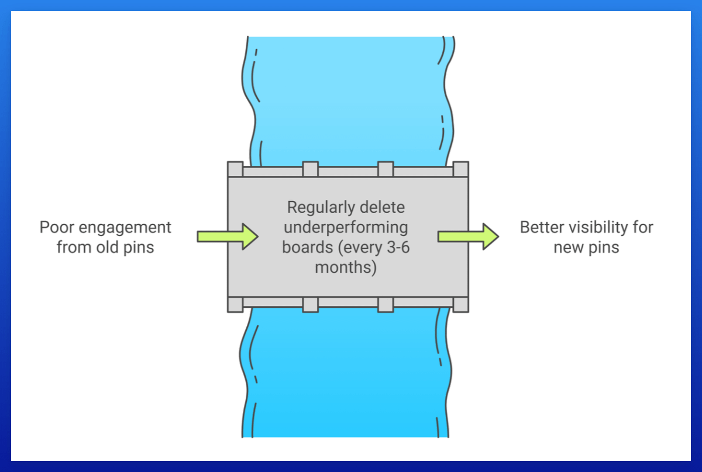

## 清理表现不佳的 Board SOP：

Pinterest 根据你的互动率表现来展示你的 Pin。

如果你有很多超过三个月且展示次数少于 10 的 Pin，并且你的整体保存率很差，你的账号表现会受到影响，你的新 Pin 将无法有效地被展示。

因此，你应该定期这样做，每隔几个月（每 3-6 个月）。

打开你的 Pinterest Analytics > 将日期范围设置为 30 天 > Export。

打开 CSV 并复制"Top Boards"下的数据。

删除 Board 链接后第一个数字超过 100 的所有行（这些是展示次数）。
这样你只有所有可能被删除的 Board。

将这些 Board 与你账号中的 Board 进行匹配。

目标是删除有太多表现不佳的 Pin 的 Board。

### 删除之前，检查：

**Pin 数量与展示次数的比率**：
如果你有一个有 100 个 Pin 和 1,000 次展示的 Board，这还不错，我会保留它。
但如果是一个有 100 个 Pin 且只有 10 次展示的 Board，大多数 Pin 零展示，我会删除它。

**Board 是否超过三个月**：
只删除超过 3 个月的表现不佳的 Board！

请记住，Board 内的所有 Pin 将自动被删除，所以**请仔细检查**。

