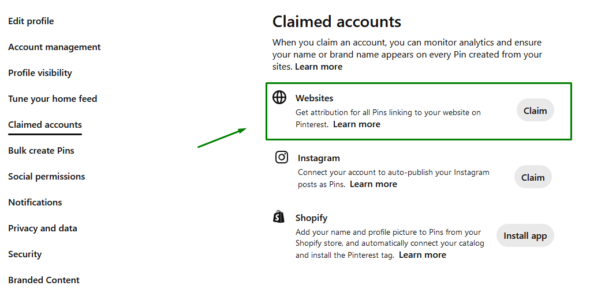
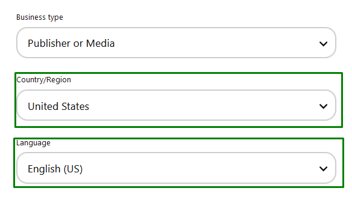
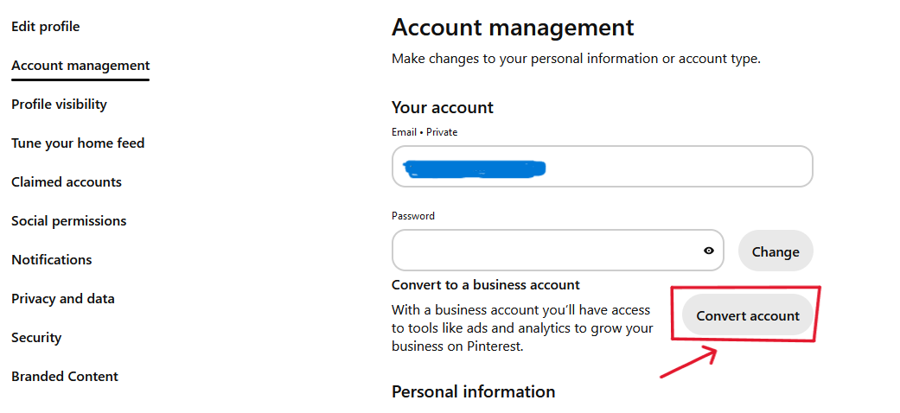
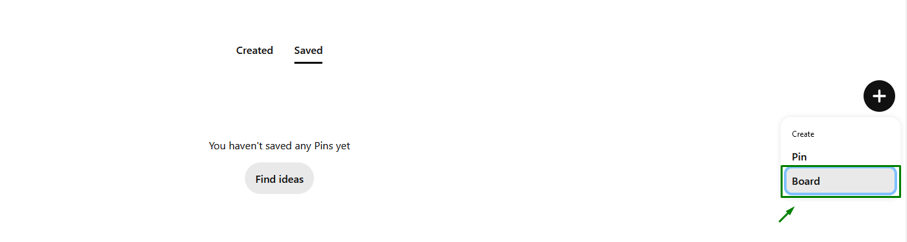
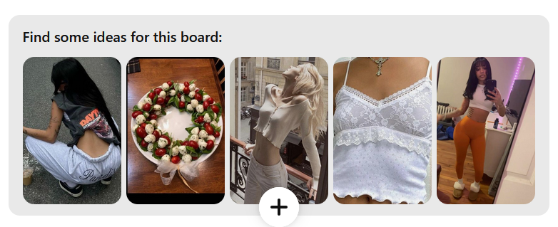

# 第一步：个人资料优化 SOP

## 第一步：个人资料设置

前往设置页面。

**Profile Photo（个人头像）**：

如果你有个人博客/品牌，请使用个人照片。

如果你有细分领域网站博客，请使用简约的极简 Logo。

我个人喜欢的 Logo 设置示例：
（保持简洁简单）

**Profile Name（个人名称）**：

使用你的个人名称或网站名称。

添加 2-3 个你涵盖的主要主题。

专业提示：如果你有足够的数据，请使用你表现最好的 Board 的 KW。

示例："*YourBrandName | 家居装饰和室内设计*"

**About（关于）**：

说明你的账号涵盖哪些主题。

包含 3-5 个你涵盖的重要 KW。

不要堆砌关键词。

**Website（网站）**：

添加你的主域名，例如

在 *设置* > *认领账号* > *网站* 下认领你的网站

**Username（用户名）**：

使用你的个人名称或网站名称。

**Email Address（电子邮件地址）**：

在此添加你的域名邮箱，例如：contact@yourbrandname.com

## 第二步：将你的账号转换为商业账号

在账号管理下，你会看到一个"转换账号"按钮。

这将让你访问 Analytics（分析）。

## 其他：

添加你的第一批 Board

添加相关的 Board 描述（包含 4-6 个相关的注解关键词）

从他人那里保存 3-5 个相关的 Pin
你可以在你的 Board 中的"为该 Board 找一些灵感"中轻松完成此操作

关注其他相关账号并与他们互动（点赞、评论、保存）

如果你不居住在美国但希望大部分流量来自那里，我建议将你的账号切换到美国。

在 *账号管理* > *个人信息* 下

