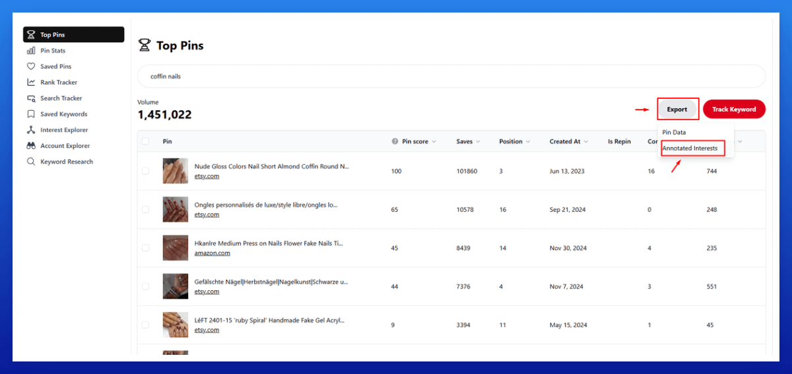

# 使用注解创建 Pin 和 Board 描述 SOP

1. 从概览表中获取 KW。

2. 前往 > Top Pins > 输入你的 KW > Export > Annotated Interests（导出 > 注解兴趣）。

3. 打开 Google Sheets。

4. 前往 File > Open > Upload 并上传注解 CSV。

5. 选择 B 列 > 右键单击 > 选择"将工作表从 Z 排序到 A"。

6. 选择 **5 个相关的注解**（"出现次数"——数字越高表示相关性越高，先选择它们）。

7. 使用 ChatGPT 或 Grok 创建描述。

8. 将完成的描述添加到概览表中。

**Pin 描述提示：**
请为我的 Pin 创建一个个人化、听起来像人的 Pinterest 描述（500 个字符以内），关键词为：[插入 KW]。
在末尾包含一个简短的 CTA（行动号召），如"立即阅读"或"稍后保存"。[插入 4 个注解]

**Board 描述提示：**
请创建一个个人化、听起来像人的 Pinterest Board 描述，其中包含这些关键词。保持在 300 个字符以内，并完全匹配使用这些关键词。[插入你的 KW 和 4 个注解]

