# 第六步：创建受顶级排名 Pin 启发的 SOP

## 为概览表中的每个 KW 高效创建新图片的步骤：

使用我们的生成 Midjourney 提示并将它们保存到 Google 电子表格中，每个关键词一个标签页。

使用我们的生成 AI 图片

从 Midjourney 下载生成的图片

解压缩 zip 文件并将图片整理到文件夹中

使用 xnConvert 后处理图片

打乱并重命名文件

将图片上传到 Google Drive

## 第一步：生成 Midjourney 提示

在隐身标签页中打开 Pinterest。

输入你想要生成图片的关键词。

下载排名前 10 的 3 张图片。

打开，如果尚未完成，配置你的 API 密钥，然后将这 3 张图片上传到生成器中。

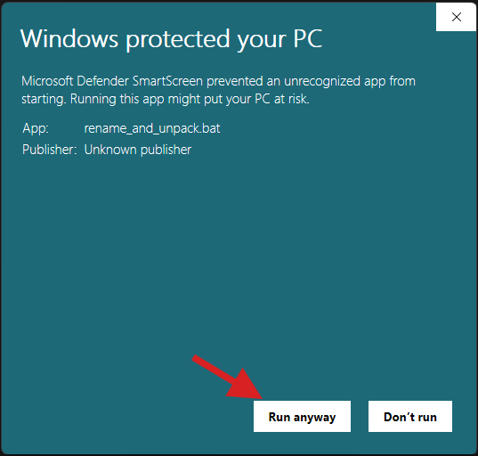

点击"Generate Prompts"开始提示生成。不到一分钟，你将收到 10 个这样的提示。

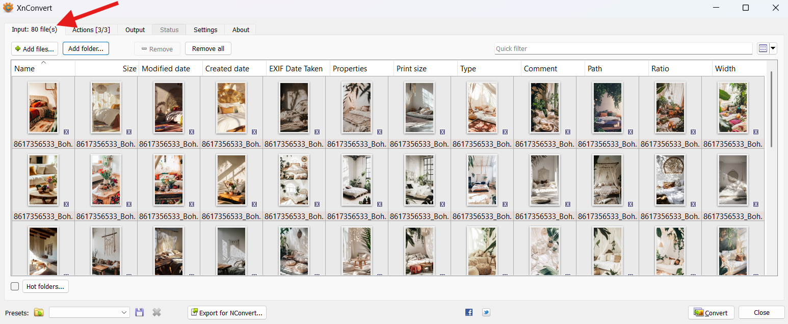

点击"Copy All"复制生成的提示。

打开现有的或新的 Google 电子表格。

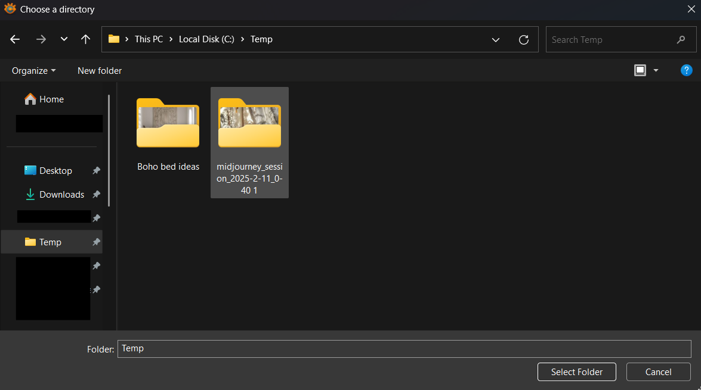

将复制的提示粘贴到电子表格中，并重命名工作表以便更好地组织。

为尽可能多的 KW 生成尽可能多的提示，以使接下来的步骤更加高效！

## 第二步：使用我们的图片提示自动化生成图片

注意：我强烈建议在第二台电脑上运行自动化，或者在你不需要电脑的时候运行——例如，在睡觉前启动它。
当自动化运行时，你的电脑将被占用，无法用于其他任务。

在第二个浏览器窗口中打开并前往 Create（提示：你可以类似地使用，尤其是对于文字叠加 Pin。

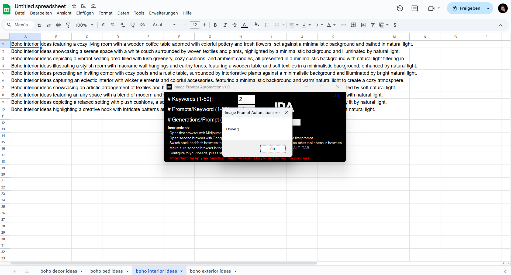

(983 KB)

下载图片提示自动化工具，启动它，并根据你的需要进行配置：

关键词数量 = 你电子表格中的标签页数量

每个关键词的提示数 = 每个关键词有多少个提示（我们通常使用 10 个）

每个提示的生成数 = 每个提示应生成多少张图片

确保带有 Midjourney 的浏览器窗口和带有 Google 电子表格的浏览器窗口是你打开的最后两个窗口，Google 电子表格是最后一个。

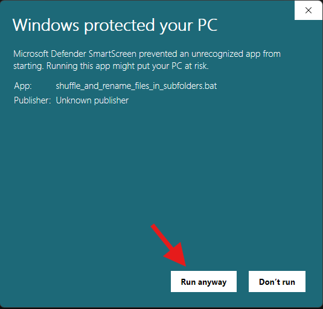

然后，切换回图片提示自动化工具并点击开始。
重要提示：工具运行时不要触摸键盘或鼠标！
该工具将最小化并通过模拟键盘和鼠标操作自动将每个提示从 Google 电子表格复制到 Midjourney。

图片提示自动化完成后，你会收到一条简短的消息。从此时起，你可以再次使用鼠标和键盘。

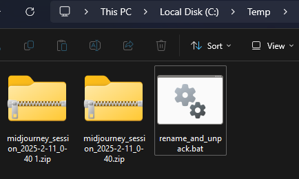

如果你是 Midjourney 或 Ideogram 的新手，请查看我们的或以获取详细指南。

## 第三步：从 Midjourney 下载图片

专业提示：按 KW 批量下载图片。这使得后续处理更加容易，因为你不必稍后再对它们进行排序（见第四步）。

如果你使用 Midjourney：

前往"Organize"并滚动到你最近生成的图片。

通过按住鼠标左键或在单击每张图片时按住 SHIFT 来选择你想要下载的所有图片。

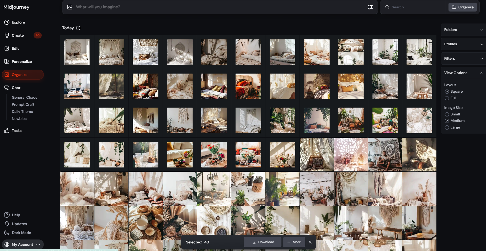

完成后，点击"Download"，所有图片将被打包成 ZIP 文件（每个文件 50 张图片）。

如果你使用 Ideogram：

前往"Creations"并滚动到你最近生成的图片。

图片按四张一组分组，因此你只需要每组选择一张图片。

要下载多张图片，请左键单击每组中一张图片上的白色复选框。

或者，在图片下方左键单击，按住点击并拖动以一次选择多张图片。

完成后，点击"Download"，所有图片将被打包成 ZIP 文件（每个文件最多 50 张图片）。

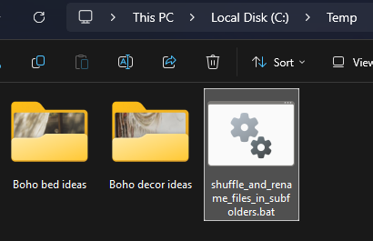

将下载的 ZIP 文件移动到你想要处理它们的指定文件夹——我们建议使用 C:/Temp 以便访问。

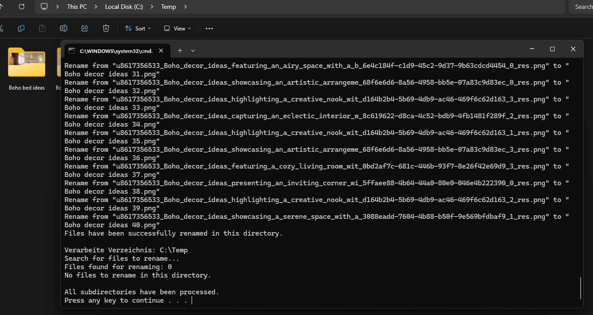

## 第四步：解压图片并将它们分类到文件夹中

使用你选择的 ZIP 工具解压所有 .zip 文件，或者使用节省时间：

下载批处理文件"rename_and_unpack.bat"

将其复制到存储所有 ZIP 文件的同一文件夹中（例如，C:/Temp）

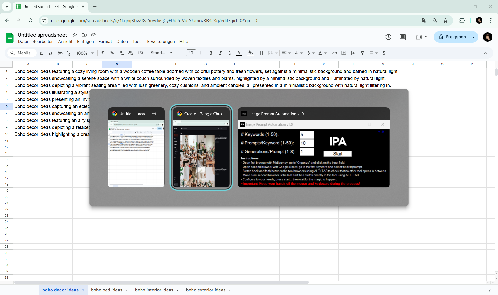

运行批处理文件，第一次你可能会收到警告，点击"更多信息"。

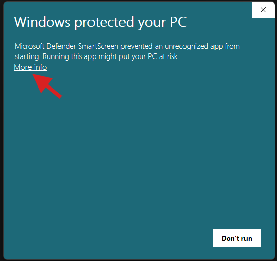

点击"Run anyway"（仍然运行）

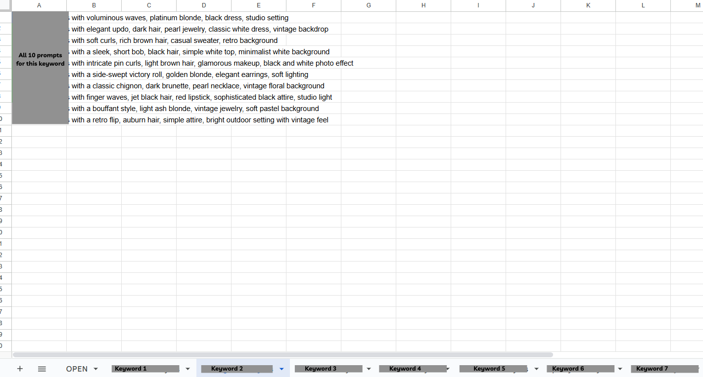

批处理文件将自动从文件名中删除特殊字符来重命名所有 .ZIP 文件（以防止任何问题），然后解压所有 ZIP 文件。

过程完成后，你将在命令行窗口中看到确认消息。

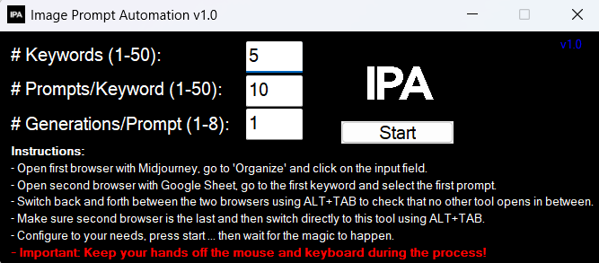

你现在可以删除所有 ZIP 文件和"rename_and_unpack.bat"文件，因为接下来的步骤不再需要它们。
如果再次需要它们，你可以在回收站中找到它们。

如果需要，将图片分类到以概览表中相应 KW 命名的文件夹中，以便于处理。

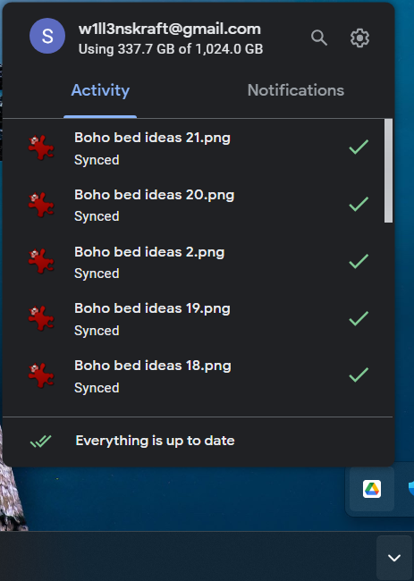

## 第五步：使用 xnConvert 后处理图片

下载 xnConvert ()，安装并启动它

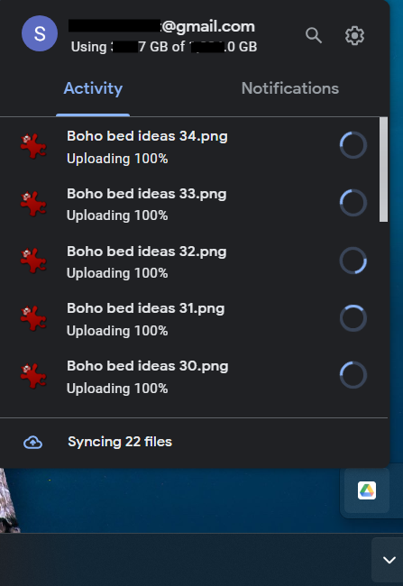

点击"Add folder"，选择你的工作文件夹（例如，C:/Temp），然后点击"Select Folder"。

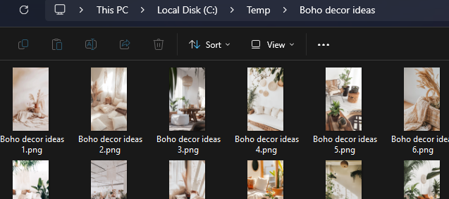

xnConvert 将显示图片总数，让你能够验证一切是否正确。

配置输出设置：

前往"Output"选项卡并按照所示进行配置。

重要说明：取消勾选"Preserve Metadata"复选框，以确保 xnConvert 删除任何不需要的数据（例如，Midjourney 用户名、提示）。

点击"Convert"，用"Yes"确认，xnConvert 将开始处理。

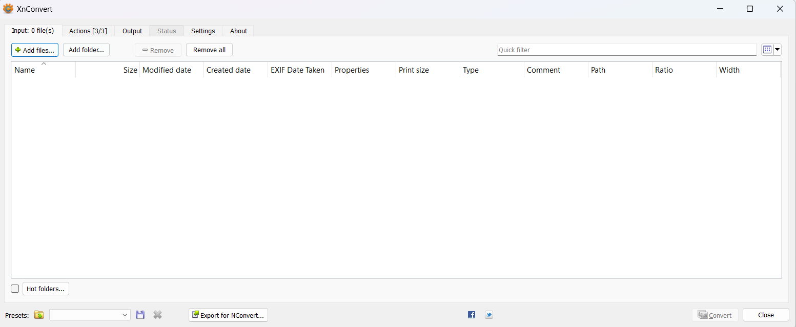

xnConvert 现在将把所有图片转换为新文件，同时删除任何不必要的元数据。

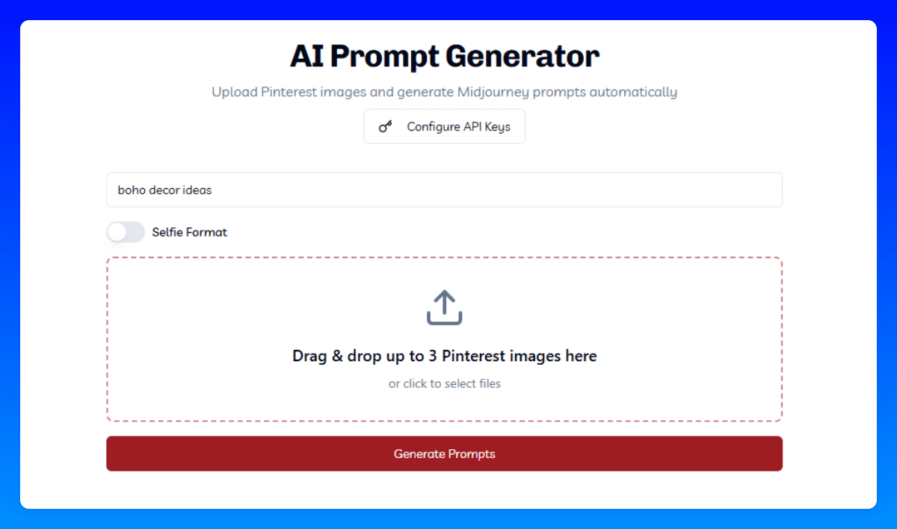

## 第六步：打乱并重命名文件

为了防止太多相似的图片连续出现，最好在每个关键词文件夹内打乱图片顺序。此外，需要重命名文件名，因为它们包含不必要的细节，如 Midjourney 用户名和提示。

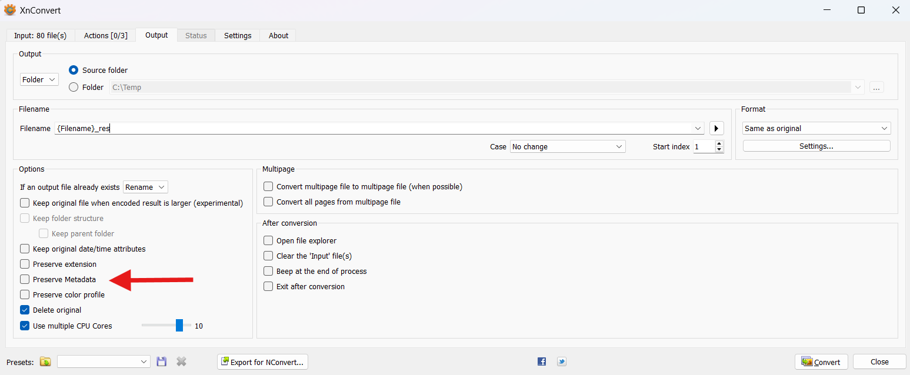

此脚本的作用：

它进入每个子文件夹。

它打乱里面的所有图片。

它根据子文件夹名称（= 关键词）重命名它们。

它重新编号它们以获得更自然和清晰的结构。

(3.6 KB)

如何使用它：

下载批处理文件"shuffle_and_rename_files_in_subfolders.bat"。

将文件复制到所有 ZIP 文件所在的同一文件夹中（例如，C:/Temp）。

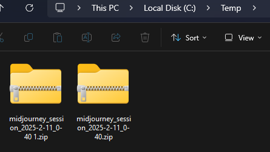

运行批处理文件。

如果第一次收到安全警告，请点击"更多信息"并继续。

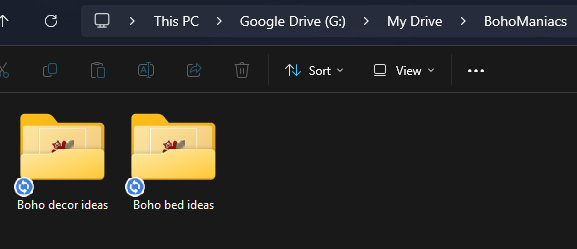

然后点击"Run anyway"（仍然运行）

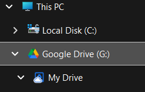

现在你有一个很棒的结果，准备好上传到 Pinterest。

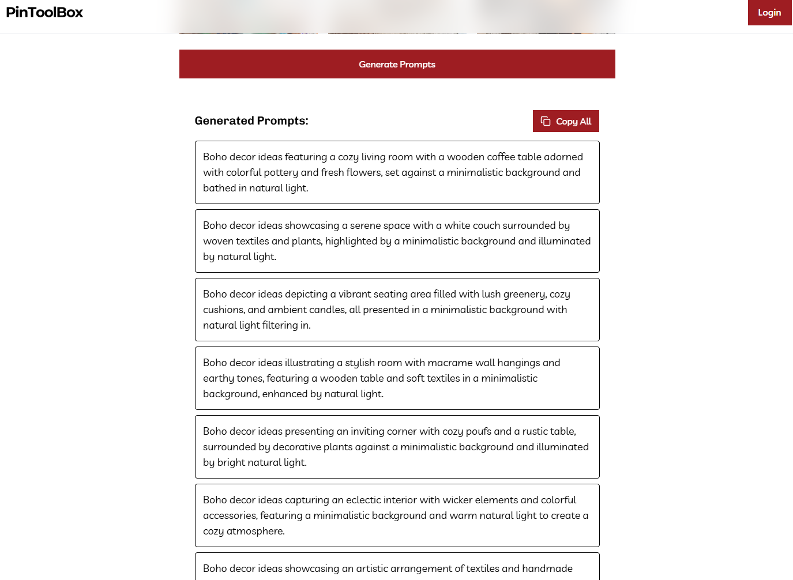

## 第七步：将图片上传到 Google Drive

与其将每张完成的图片直接逐个上传到 Pinterest，不如先将它们全部上传到 Google Drive，这样效率更高。这样，你和你的团队可以将所有图片存储在一个中心位置，以便轻松访问。

下载并安装 Google Drive for Desktop 并将其连接到你的 Google 账户。

安装后，一个新的驱动器（通常是 G:）将出现在你的电脑上。

复制文件

将完成的图片文件夹（从第三步）移动到你的本地 Google Drive 文件夹中。

自动上传

Google Drive for Desktop 会自动将文件同步到你的云存储。

要检查上传状态，请点击 Google Drive 图标。

如果你看到此成功消息，表示所有内容都已成功传输。

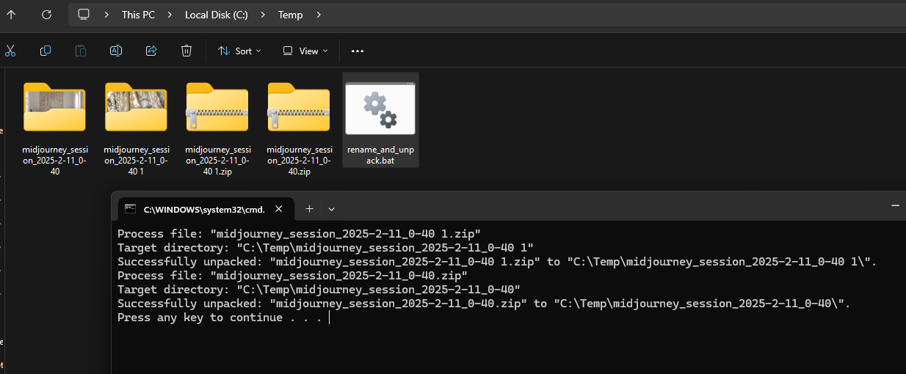

清理

上传完成后，你可以安全地从本地工作文件夹（例如，C:/Temp）中删除所有文件。

