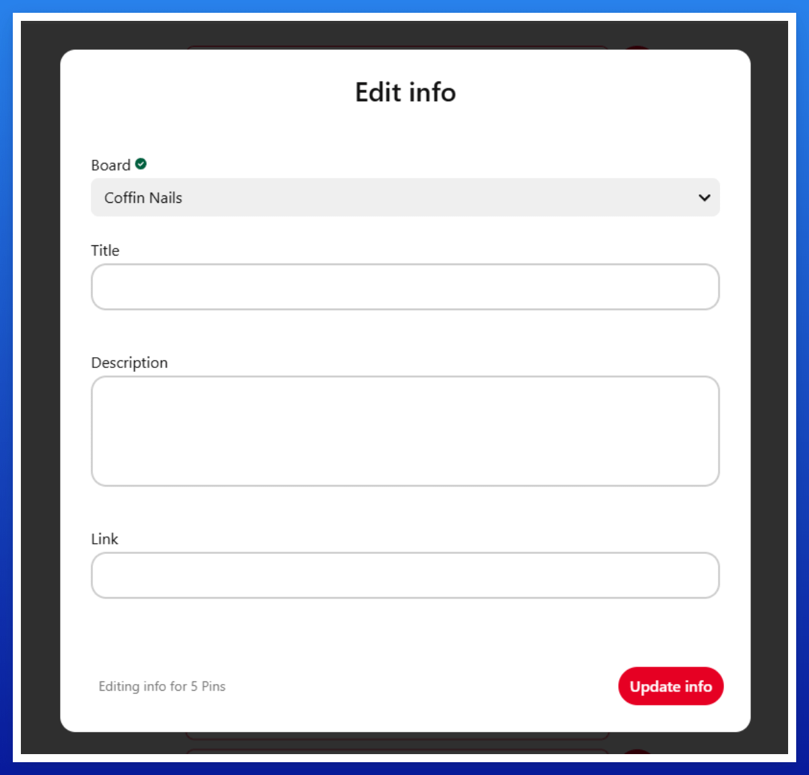
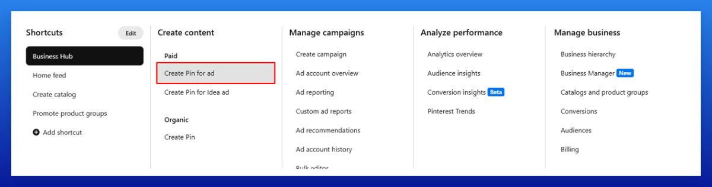

# 高效 Pin 上传 SOP

我们每天上传 8-12 个 Pin 获得最佳效果。这也是我向你推荐的。

## 高效 Pin 上传

如果你有多个账号，请打开你的 VPN（始终对同一账号组使用相同位置，每组最多 10 个账号）。更多相关信息。

打开 Pinterest。

点击""——别担心，它不会创建真正的广告。

将 4 张将链接到同一 URL 的图片拖到调度器中。

点击右上角的圆圈 > 全选 > 点击画笔图标。

对于这 4 个 Pin，选择你的 Board，并添加标题、描述和 URL。

对另一篇文章的 4 个 Pin 重复此操作，并添加 2-4 个没有标题、描述或 URL 的 Scout Pin。

### 注意：

通过向同一 URL 上传 4 个 Pin 而被垃圾邮件过滤器捕获的风险极低。

在我这样做的 5 年中，我从未遇到过问题，这是我使用的最古老的上传方法。

