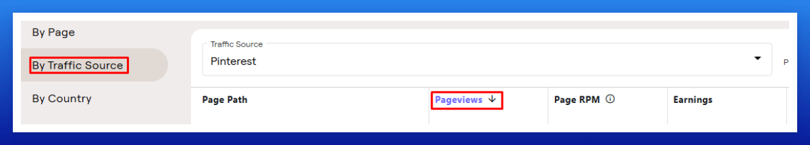
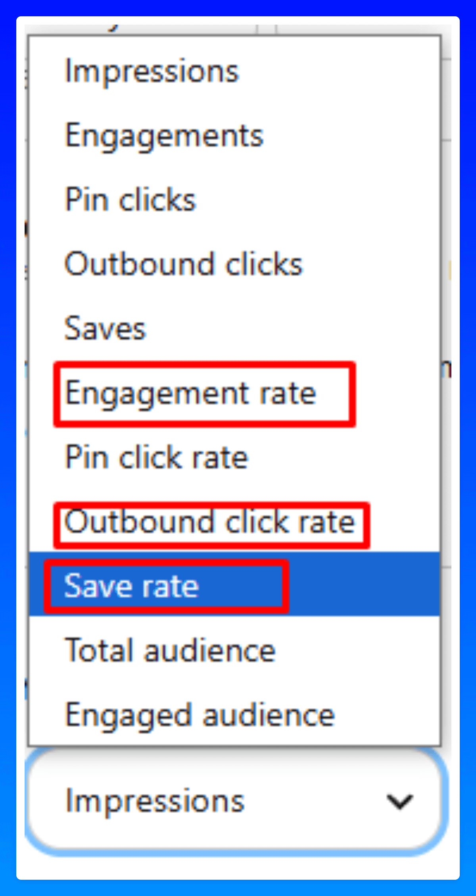

# 分析数据审查 SOP

建议每月彻底检查一次你的分析数据，而不是频繁且随意地查看。在这个业务中，日常波动是正常的，但不要让它们影响你。

真正重要的是从月到月、从年到年的发展趋势，而不是每天的表现。

## 分析数据审查 SOP

在你的广告项目中审查你的网站：

哪些文章具有较高的 RPM 且获得了更多点击？

例如，在 Raptive 中：前往 Earnings > By Traffic Source > Pinterest > 切换到 Pageviews。这将显示过去 30 天内哪些文章获得了最多点击以及它们的 RPM。

对于那些有良好点击和 RPM 的文章，考虑创建更多 Pin（比如再创建 20-25 个，使用不同的标题、描述，可能还有不同的 URL）并研究新的 KW 变体。
我通常会同时进行这两项工作。

我还会审查我的保存率、互动率和外链点击率，以及新 Pin 开始获得展示的速度。

如果你新上传的 Pin 在几天后仍然有 0 展示，这是你的互动和保存率下降的早期信号，Pinterest 会减少展示你的 Pin。

我还会分析过去 30 天内哪些 Pin 获得了最多的外链点击，并寻找模式——例如文字叠加、拼贴还是普通图片表现最好。
一旦确定了模式，我会更加专注于那些高表现格式以最大化结果。

