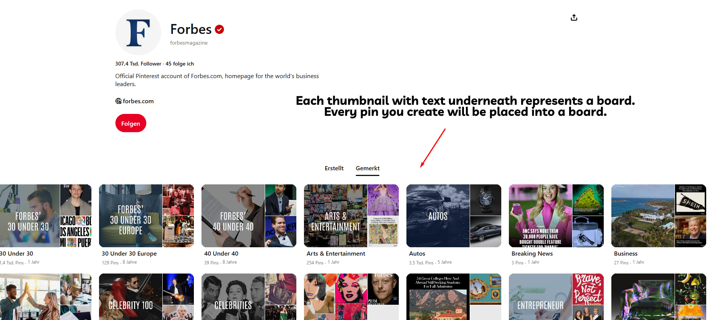
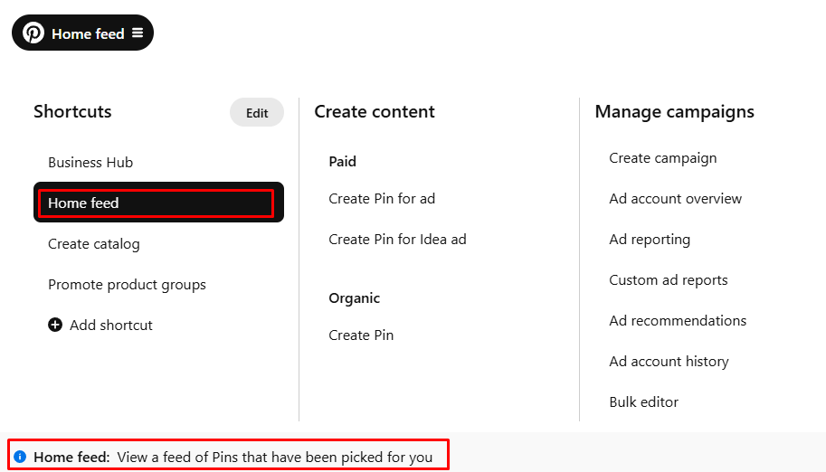
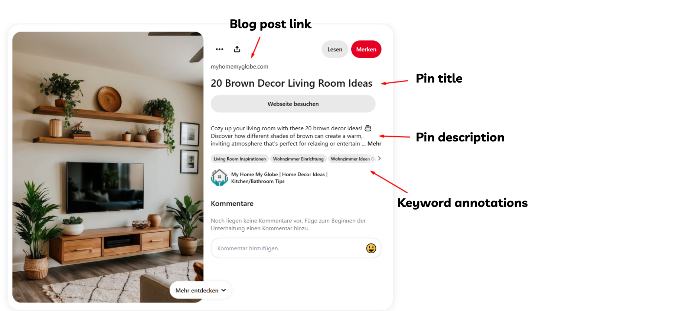
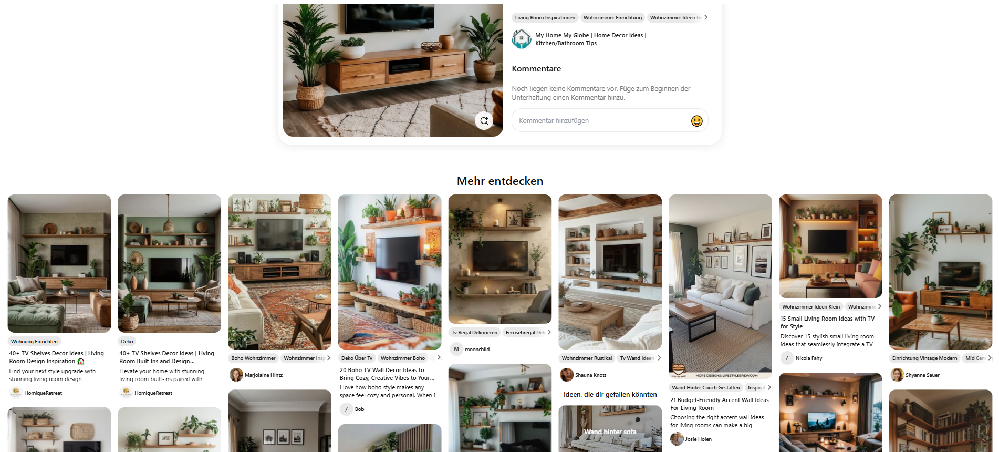
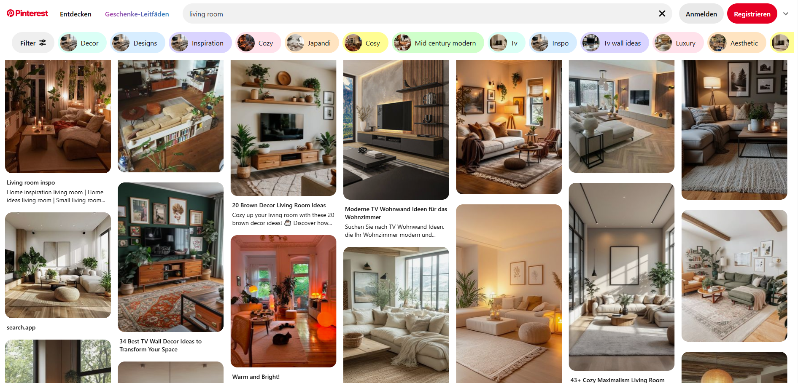

# 3-Glossary

**文档摘要：** 本词汇表解释了系统中常用的 Pinterest 术语与指标，涵盖账号与内容组织（Board、Business Account、Pin、Save）、流量与数据指标（CTR、Outbound Click、RPM、Pinterest Analytics）、工具与趋势来源（GA、Pinterest Trends/Predicts、算法 PinSage/Pin2Interest/Pixie）、以及多账号管理与合规相关概念（Proxy、VPN、Duplicate Content）。

## 正文

### Page 1

Before we dive in, I want to make sure you’re familiar with all the key terms we're using in this system and
our tools.
Even if you’ve been on Pinterest for a while, this could be a great refresher to keep everything top of mind!
Board
When you create a Board, you organize your Pins by topic or theme. Boards help you manage your
content by grouping similar ideas together.
Business Account
Convert your personal account to a Business Account to access advanced features such as analytics,
advertising options, and other business tools that help you monitor and grow your Pinterest presence.
CTR (Click-Through Rate)
You track CTR to see the percentage of viewers who click on a Pin’s link. This metric tells you how
effective your Pins are at driving traffic from Pinterest to your website.
Content Clusters
Group related articles or Pins into content clusters to target similar keywords and topics. By doing this,
you build topical authority and sustain long-term traffic growth.
Duplicate Content
Pins or images that are identical or nearly identical—avoid posting them. Pinterest’s algorithms can
detect duplicates, which may hurt your account’s overall performance.
GA (Google Analytics)
Integrate Google Analytics with your system to monitor website traffic. GA provides you with detailed
insights beyond Pinterest’s native analytics, helping you assess the performance of your linked content.
Hostinger
We use Hostinger to efficiently set up and manage multiple websites. It’s great for creating template-
based sites, but when a site starts getting more traffic, we switch to another hosting provider.

### Page 2

Home Feed
Your Home Feed is the main page on Pinterest that displays a personalized selection of Pins based on
your interests, search history, and engagement. This is where you discover fresh content and trends.
Incognito Tab
Browse Pinterest in an incognito tab when you need to see unbiased search results or trend data without
the influence of your personalized history and cookies.
Interests
Your interests are the topics and categories that define your Pinterest experience. Pinterest uses these to
recommend Pins and tailor content specifically for you.
Outbound Click
When you click a link in a Pin that takes you to an external website, it counts as an outbound click. This is
a critical metric if you’re looking to monetize your content or drive traffic to your site.
Pin (Image/Video Post)
Every Pin is an image or video you post on Pinterest. When you create a Pin, include a catchy title, a
detailed description with relevant keyword annotations, and a link to your blog post.

### Page 3

Save
You “save” a Pin by adding it to one of your boards. Whether you find a Pin on Pinterest or save an image
from the web using the Pinterest app, browser extension, or your device’s share function, saving helps you
curate content that inspires you.
Related Pins
When you view a Pin’s detail page, you’ll see a “More like this” section with related Pins. Engage with
these suggestions to explore additional content that aligns with your interests and strategies.
Pinterest Analytics
Use Pinterest Analytics (available at analytics.pinterest.com) to track how your Pins and Boards perform.
This tool provides you with data that you can use to fine-tune your content and strategy.

### Page 4

Pinterest Predicts
Rely on Pinterest Predicts as an annual forecasting report that identifies emerging trends. Use these
insights to stay ahead of what will soon capture your audience’s interest.
Pinterest Trends
Visit Pinterest Trends to see which topics and keywords are hot right now. This free tool helps you ensure
that your content remains fresh and relevant to what users are currently searching for.
PinSage, Pin2Interest, Pixie
These internal Pinterest algorithms analyze visual, textual, and contextual data. They help you by
categorizing your Pins, recommending related content, and optimizing how content appears in users’
feeds.
Proxy
When managing multiple Pinterest accounts, you can use a proxy to assign fixed IP addresses to specific
accounts. Although proxies offer less flexibility than VPNs, they help you manage your accounts more
securely.
RPM (Revenue per Mille)
Keep an eye on RPM, which estimates the revenue you earn per 1,000 pageviews. This metric is key for
assessing the profitability of your content and ad placements.
SOP (Standard Operating Procedure)
Follow SOPs to complete specific tasks consistently. These detailed, step-by-step instructions ensure that
you maintain efficiency and accuracy in your processes.
Scout Pins
Create Scout Pins without a title, description, or URL to test new engagement strategies. Use them to
boost engagement rates while keeping your search ranking signals unaffected.
Search
Treat Pinterest as a powerful image search engine. When you optimize your Pins and Boards with the
right keywords and annotations, you improve their discoverability through Pinterest search.

### Page 5

Rich Pins
Implement Rich Pins to automatically display extra details from your website. When you set these up,
Pinterest pulls the title and description from your site’s open graph meta tags, offering your audience
more context right on the Pin.
Keyword Annotations
Ensure that you include relevant annotations in your pin and board descriptions. These keyword
annotations help Pinterest understand your content, boosting its visibility to your target audience.
VPN (Virtual Private Network)
Use a VPN to create a secure, encrypted connection that masks your IP address. This is essential when
managing multiple Pinterest accounts, as it reduces the risk of bans and enhances your privacy.
Overview Sheet
Maintain an overview sheet—a centralized document or spreadsheet—to track keywords, article URLs,
titles, and the progress of your tasks across websites or Pinterest accounts. This helps you stay
organized and on top of your strategy.
KW (Keyword)
Incorporate specific search terms or phrases (keywords) into your content strategy. By optimizing your
Pins and Boards with the right KW, you boost your visibility in Pinterest’s search engine.

## 图片

