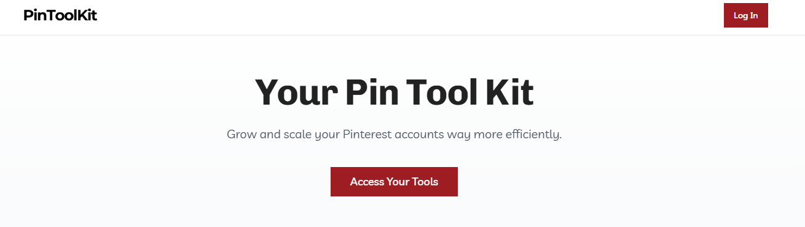

# 4-The Pin Tool Kit

**文档摘要：** 本页说明 Pin Tool Kit 的访问方式与登录步骤：使用注册时相同邮箱注册，首次登录需重置密码并留意邮箱/垃圾箱。工具可直接使用 OpenAI API，额外成本仅为 API 用量。

## 正文

### Page 1

You can access our tools directly at Pintoolkit.com.
To ensure that only users of the PinScaleSystem can sign up, please use the same email address you
used to register here.
When logging in for the first time, reset your password. It may take a few minutes for the email to arrive,
and if you don’t see it in your inbox, be sure to check your spam folder as well.
You can easily use our tools with your OpenAI API, so you don't have to pay anything extra to use them
besides a few OpenAI credits.
You can set up an API key here: https://platform.openai.com/api-keys

## 图片

